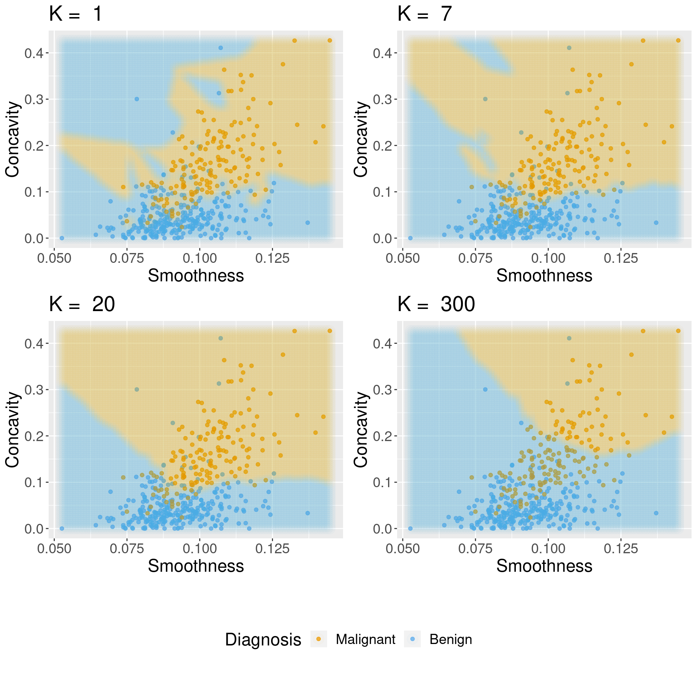
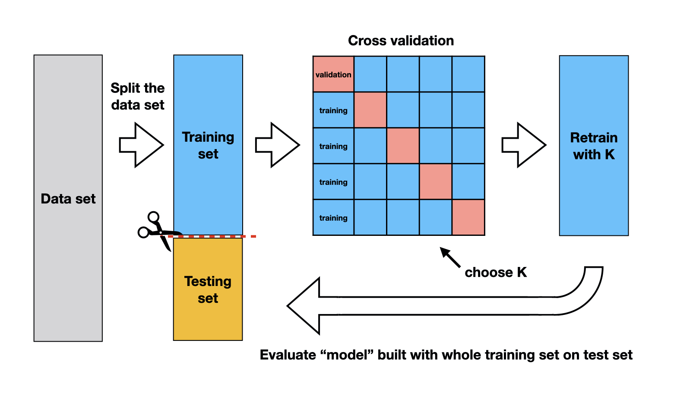

Fuente: https://datasciencebook.ca/classification2.html 

# Capítulo 6 Clasificación II: evaluación y ajuste

## 6.1 Resumen
Este capítulo continúa la introducción al modelado predictivo a través de la clasificación. Si bien el capítulo anterior cubrió el entrenamiento y el preprocesamiento de datos, este capítulo se enfoca en cómo evaluar la precisión de un clasificador, así como también en cómo mejorar el clasificador (donde sea posible) para maximizar su precisión.
 
## 6.2 Objetivos de aprendizaje del capítulo

Al final del capítulo, los lectores podrán hacer lo siguiente:

- Describir qué son los conjuntos de datos de entrenamiento, validación y prueba y cómo se utilizan en la clasificación.
- Divida los datos en conjuntos de datos de entrenamiento, validación y prueba.
- Describir qué es una semilla aleatoria y su importancia en el análisis de datos reproducibles.
- Establezca la semilla aleatoria en R usando la función `set.seed`.
- Evalúe la precisión de la clasificación en R utilizando un conjunto de datos de validación y métricas adecuadas.
- Ejecute la validación cruzada en R para elegir el número de vecinos en un clasificador k-nearest neghbor.
- Describir las ventajas y desventajas del algoritmo k-nearest neighbor.

## 6.3 Evaluación de la precisión

A veces, nuestro clasificador puede hacer una predicción incorrecta. Un clasificador no necesita estar en lo correcto el 100% del tiempo para ser útil, aunque no queremos que el clasificador haga demasiadas predicciones incorrectas. ¿Cómo medimos qué tan "bueno" es nuestro clasificador? Revisemos los datos de imágenes de cáncer de mama (Street, Wolberg y Mangasarian 1993) y pensemos en cómo se usará nuestro clasificador en la práctica. Se realizará una biopsia del tumor de un nuevo paciente, se analizará la imagen resultante y se le pedirá al clasificador que decida si el tumor es benigno o maligno. La palabra clave aquí es *new*: nuestro clasificador es "bueno" si proporciona predicciones precisas sobre datos que no se ven durante el entrenamiento. Pero entonces, ¿cómo podemos evaluar nuestro clasificador sin visitar el hospital para recolectar más imágenes del tumor?

El truco consiste en dividir los datos en **training set** y **test set** (Figura 6.1) y usar solo el conjunto de entrenamiento al construir el clasificador. Luego, para evaluar la precisión del clasificador, primero apartamos las etiquetas verdaderas del conjunto de prueba y luego usamos el clasificador para predecir las etiquetas en el conjunto de prueba. Si nuestras predicciones coinciden con las etiquetas verdaderas para las observaciones en el conjunto de prueba, entonces tenemos cierta confianza en que nuestro clasificador también podría predecir con precisión las etiquetas de clase para nuevas observaciones sin etiquetas de clase conocidas.

*Nota: si hubiera una regla de oro del aprendizaje automático, podría ser esta: ¡no puede usar los datos de prueba para construir el modelo! Si lo hace, el modelo puede "ver" los datos de prueba por adelantado, lo que hace que parezca más preciso de lo que realmente es. ¡Imagínese lo malo que sería sobrestimar la precisión de su clasificador al predecir si el tumor de un paciente es maligno o benigno!*
```{r Figure_6.1,echo=FALSE, fig.align='center', fig.cap='Figura 6.1: Figure 6.1: Splitting the data into training and testing sets.',fig.width=10}
knitr::include_graphics("images/Figure_6.1.jpeg")
```

¿Cómo podemos evaluar exactamente qué tan bien nuestras predicciones coinciden con las etiquetas verdaderas para las observaciones en el conjunto de prueba? Una forma en que podemos hacer esto es calcular la precisión de la predicción. Esta es la fracción de ejemplos para los que el clasificador hizo la predicción correcta. Para calcular esto, dividimos el número de predicciones correctas por el número de predicciones realizadas.

prediction accuracy = number of correct predictions/total number of predictions

El proceso para evaluar si nuestras predicciones coinciden con las etiquetas verdaderas en el conjunto de prueba se ilustra en la Figura 6.2. Tenga en cuenta que existen otras medidas sobre el desempeño de los clasificadores, como *precision* y *recall*; estos no se discutirán aquí, pero es probable que los encuentre en otros libros más avanzados sobre este tema.
```{r Figure_6.2,echo=FALSE, fig.align='center', fig.cap='Figura 6.1: Figure 6.2: Process for splitting the data and finding the prediction accuracy.',fig.width=10}
knitr::include_graphics("images/Figure_6.2.png")
```


6.4 Aleatoriedad y semillas

A partir de este capítulo, nuestros análisis de datos a menudo implicarán el uso de la **aleatoriedad**. Usamos la aleatoriedad cada vez que necesitamos tomar una decisión en nuestro análisis que debe ser justa, imparcial y no influenciada por el aporte humano. Por ejemplo, en este capítulo, necesitamos dividir un conjunto de datos en un conjunto de entrenamiento y un conjunto de prueba para evaluar nuestro clasificador. Ciertamente, no queremos elegir cómo dividir los datos nosotros mismos a mano, ya que queremos evitar influir accidentalmente en el resultado de la evaluación. Entonces, en lugar de eso, dejamos que R divida aleatoriamente los datos. En capítulos futuros, usaremos la aleatoriedad de muchas otras formas, por ejemplo, para ayudarnos a seleccionar un pequeño subconjunto de datos de un conjunto de datos más grande, para elegir grupos de datos y más.

Sin embargo, el uso de la aleatoriedad va en contra de uno de los principios fundamentales de las buenas prácticas de análisis de datos: la **reproducibilidad**. Recuerde que un análisis reproducible produce el mismo resultado cada vez que se ejecuta; si incluimos la aleatoriedad en el análisis, ¿no obtendríamos un resultado diferente cada vez? El truco es que en R, y otros lenguajes de programación, ¡la aleatoriedad no es realmente aleatoria! En cambio, R usa un generador de números aleatorios que produce una secuencia de números que están completamente determinados por un valor semilla. Una vez que establezca el valor inicial con la función `set.seed`, todo después de ese punto puede parecer aleatorio, pero en realidad es totalmente reproducible. ¡Mientras elija el mismo valor inicial, obtendrá el mismo resultado!

Usemos un ejemplo para investigar cómo funcionan las semillas en R. Digamos que queremos elegir al azar 10 números del 0 al 9 en R usando la función `sample`, pero queremos que sea reproducible. Antes de usar la función de muestra, llamamos a `set.seed` y le pasamos cualquier número entero como argumento. Aquí, pasamos en el número 1.
```{r}
set.seed(1)
random_numbers <- sample(0:9, 10, replace=TRUE)
random_numbers
```

En otras palabras, aunque las secuencias de números que genera R parecen aleatorias, ¡están totalmente determinadas cuando establecemos un valor inicial!

Entonces, ¿qué significa esto para el análisis de datos? Bueno, sample ciertamente no es la única función que usa aleatoriedad en R. Muchas de las funciones que usamos en tidymodels, tidyverse y más allá usan aleatoriedad, muchas de ellas sin siquiera decírselo. Entonces, al comienzo de cada análisis de datos que realice, justo después de cargar paquetes, debe llamar a la función `set.seed` y pasarle el número entero que elija. También tenga en cuenta que cuando R se inicia, crea su propia semilla para usar. Entonces, si no llama explícitamente a la función `set.seed` en su código, es probable que sus resultados no sean reproducibles. Y finalmente, tenga cuidado de configurar la semilla solo una vez al comienzo de un análisis de datos. Cada vez que establece la semilla, está insertando su propia entrada humana, lo que influye en el análisis. Si usa `set.seed` muchas veces a lo largo de su análisis, la aleatoriedad que usa R no parecerá tan aleatoria como debería.

En resumen: si desea que su análisis sea reproducible, es decir, que produzca el mismo resultado cada vez que lo ejecuta, asegúrese de usar `set.seed` exactamente una vez al comienzo del análisis. Diferentes valores de argumento en set.seed conducen a diferentes patrones de aleatoriedad, pero siempre que elija el mismo valor de argumento, su resultado será el mismo. En el resto del libro de texto, estableceremos la semilla una vez al comienzo de cada capítulo.

## 6.5 Evaluación de la precisión con tidymodels
¡Volvamos a evaluar clasificadores ahora! En R, podemos usar el paquete tidymodels no solo para realizar k-nearet neighbor classification, sino también para evaluar qué tan bien funcionó nuestra clasificación. Analicemos un ejemplo de cómo usar las herramientas de `tidymodels` para evaluar un clasificador usando el conjunto de datos de cáncer de mama del capítulo anterior. 

Comenzamos el análisis cargando los paquetes que requerimos, leyendo los datos de cáncer de mama y luego haciendo una visualización rápida de diagrama de dispersión de la concavidad de las células tumorales versus la suavidad coloreada por el diagnóstico en la Figura 6.3. También notará que configuramos la semilla aleatoria aquí al comienzo del análisis usando la función `set.seed`, como se describe en la Sección 6.4.

```{r}
# load packages
library(tidyverse)
library(tidymodels)

# set the seed
set.seed(1)

# load data
cancer <- read_csv("Input/data2.csv") |>
  # convert the character Class variable to the factor datatype
  mutate(class = as_factor(class)) 

# create scatter plot of tumor cell concavity versus smoothness,
# labeling the points be diagnosis class
perim_concav <- cancer |>
  ggplot(aes(x = smoothness, y = concavity, color = class)) +
  geom_point(alpha = 0.5) +
  labs(color = "Diagnosis") +
  scale_color_manual(labels = c("Malignant", "Benign"), 
                     values = c("orange2", "steelblue2")) + 
  theme(text = element_text(size = 12))

perim_concav
```

### 6.5.1 Crear la división train/test

Una vez que hemos decidido responder una pregunta predictiva y hemos realizado una exploración preliminar, lo siguiente que debemos hacer es dividir los datos en conjuntos de entrenamiento y de prueba. Por lo general, el conjunto de entrenamiento está entre el 50 % y el 95 % de los datos, mientras que el conjunto de prueba está entre el 5 % y el 50 % restante; la intuición es que desea negociar entre entrenar un modelo preciso (mediante el uso de un conjunto de datos de entrenamiento más grande) y obtener una evaluación precisa de su rendimiento (mediante el uso de un conjunto de datos de prueba más grande). Aquí, usaremos el 75 % de los datos para entrenamiento y el 25 % para pruebas.

La función `initial_split` de `tidymodels` maneja el procedimiento de dividir los datos por nosotros. También aplica dos pasos muy importantes al dividir para garantizar que las estimaciones de precisión de los datos de prueba sean razonables. Primero, mezcla (shuffles) los datos antes de dividirlos, lo que garantiza que cualquier orden presente en los datos no influya en los datos que terminan en los conjuntos de entrenamiento y prueba. En segundo lugar, estratifica los datos por la etiqueta de clase, para garantizar que aproximadamente la misma proporción de cada clase termine en los conjuntos de entrenamiento y prueba. Por ejemplo, en nuestro conjunto de datos, aproximadamente el 63 % de las observaciones son de la clase benigna (B) y el 37 % son de la clase maligna (M), por lo que `initial_split` asegura que aproximadamente el 63 % de los datos de entrenamiento son benignos, y 37% de los datos de entrenamiento son malignos y las mismas proporciones existen en los datos de prueba.

Usemos la función `initial_split` para crear los conjuntos de entrenamiento y prueba. Especificaremos que `prop = 0.75` para que el 75% de nuestro conjunto de datos original termine en el conjunto de entrenamiento. También estableceremos el argumento de estratos en la variable de etiqueta categórica (aquí, `class`) para garantizar que los subconjuntos de entrenamiento y prueba contengan las proporciones correctas de cada categoría de observación. Las funciones de entrenamiento y prueba luego extraen los conjuntos de datos de entrenamiento y prueba en dos marcos de datos separados. Tenga en cuenta que la función `initial_split` utiliza la aleatoriedad, pero dado que configuramos la semilla anteriormente en el capítulo, la división será reproducible.

```{r}
cancer_split <- initial_split(cancer, prop = 0.75, strata = class)
cancer_train <- training(cancer_split)
cancer_test <- testing(cancer_split) 
```

```{r}
glimpse(cancer_train)
glimpse(cancer_test)
```

Podemos ver en el código anterior que el conjunto de entrenamiento contiene 426 observaciones, mientras que el conjunto de prueba contiene 143 observaciones. Esto corresponde a una división de tren / prueba de 75% / 25%, según se desee. Recuerde del Capítulo 5 que usamos la función de vistazo para ver datos con una gran cantidad de columnas, ya que imprime los datos de tal manera que las columnas van hacia abajo en la página (en lugar de horizontalmente).

Podemos usar `group_by` y `summarize` para encontrar el porcentaje de clases malignas y benignas en `cancer_train` y vemos que aproximadamente el 63 % de los datos de entrenamiento son benignos y el 37 % son malignos, lo que indica que nuestras proporciones de clase se conservaron aproximadamente cuando dividimos los datos.
```{r}
cancer_proportions <- cancer_train |>
                      group_by(class) |>
                      summarize(n = n()) |>
                      mutate(percent = 100*n/nrow(cancer_train))

cancer_proportions
```

6.5.2 Preprocesar los datos

Como mencionamos en el capítulo anterior, k-nearest neighbors son sensibles a la escala de los predictores, por lo que debemos realizar un preprocesamiento para estandarizarlos. Una consideración adicional que debemos tener al hacer esto es que debemos crear el preprocesador de estandarización usando solo los datos de entrenamiento. Esto garantiza que nuestros datos de prueba no influyan en ningún aspecto del entrenamiento de nuestro modelo. Una vez que hemos creado el preprocesador de estandarización, podemos aplicarlo por separado a los conjuntos de datos de entrenamiento y prueba.

Afortunadamente, `recipes` de `tidymodels` nos ayuda a manejar esto correctamente. A continuación, construimos y preparamos la receta usando solo los datos de entrenamiento (debido a data = `cancer_train` en la primera línea).
```{r}
cancer_recipe <- recipe(class ~ smoothness + concavity, data = cancer_train) |>
  step_scale(all_predictors()) |>
  step_center(all_predictors())
```

6.5.3 Entrenar al clasificador
Ahora que hemos dividido nuestro conjunto de datos original en conjuntos de entrenamiento y prueba, podemos crear nuestro clasificador k-nearest neighbor con solo el conjunto de entrenamiento usando la técnica que aprendimos en el capítulo anterior. Por ahora, solo elegiremos el número k de vecinos sea 3, y use la concavidad y la suavidad como predictores. Como antes, necesitamos crear una especificación de modelo, combinar la especificación del modelo y la receta en un flujo de trabajo y, finalmente, usar fit con los datos de entrenamiento cancer_train para construir el clasificador.
```{r}
knn_spec <- nearest_neighbor(weight_func = "rectangular", neighbors = 3) |>
  set_engine("kknn") |>
  set_mode("classification")

knn_fit <- workflows::workflow() |>
  workflows::add_recipe(cancer_recipe) |>
  workflows::add_model(knn_spec) |>
  parsnip::fit(data = cancer_train)

knn_fit
```

### 6.5.4 Predecir las etiquetas en el conjunto de prueba

Ahora que tenemos un clasificador k-nearest neghbor, podemos usarlo para predecir las etiquetas de clase para nuestro conjunto de prueba. Usamos `bind_cols` para agregar la columna de predicciones a los datos de prueba originales, creando el marco de datos `cancer_test_predictions`. La variable `Class` contiene los diagnósticos verdaderos, mientras que `.pred_class` contiene los diagnósticos predichos del clasificador.
```{r}
cancer_test_predictions <- predict(knn_fit, cancer_test) |>
  bind_cols(cancer_test)

cancer_test_predictions
```

### 6.5.5 Calcular la precisión

Finalmente, podemos evaluar la precisión de nuestro clasificador. Para ello utilizamos la función de métricas de tidymodels para obtener las estadísticas sobre la calidad de nuestro modelo, especificando los argumentos de verdad y estimación:
```{r}
cancer_test_predictions |>
  metrics(truth = class, estimate = .pred_class) |>
  filter(.metric == "accuracy")
```

En el marco de datos de métricas, filtramos la columna `.metric` porque nos interesa la fila `accuracy`. Otras entradas involucran métricas más avanzadas que están más allá del alcance de este libro. Observar el valor de la variable .estimate muestra que la precisión estimada del clasificador en los datos de prueba fue del 86 %.

También podemos mirar la matriz de confusión para el clasificador, que muestra la tabla de etiquetas predichas y etiquetas correctas, usando la función `conf_mat`:
```{r}
confusion <- cancer_test_predictions |>
             conf_mat(truth = class, estimate = .pred_class)

confusion
```

La matriz de confusión muestra que 39 observaciones se predijeron correctamente como malignas y 84 se predijeron correctamente como benignas. Por lo tanto, el clasificador etiquetó correctamente 39 + 84 = 123 observaciones. También muestra que el clasificador cometió algunos errores; en particular, clasificó 14 observaciones como benignas cuando eran verdaderamente malignas y 6 observaciones como malignas cuando eran verdaderamente benignas.

### 6.5.6 Analizar críticamente el desempeño

Ahora sabemos que el clasificador tenía una precisión del 86 % en el conjunto de datos de prueba. ¡Eso suena bastante bien! Espera, ¿está bien? ¿O necesitamos algo más alto?

En general, lo que es un buen valor para la precisión depende de la aplicación. Por ejemplo, suponga que está prediciendo si un tumor es benigno o maligno para un tipo de tumor que es benigno el 99 % de las veces. Es muy fácil obtener una precisión del 99 % simplemente adivinando que es benigno para cada observación. En este caso, una precisión del 99 % probablemente no sea suficiente. Y más allá de la precisión, a veces el tipo de error que comete el clasificador también es importante. En el ejemplo anterior, podría ser muy malo que el clasificador predijera "benigno" cuando la verdadera clase es "maligna", ya que esto podría provocar que un paciente no reciba la atención médica adecuada. Por otro lado, podría ser menos malo para el clasificador adivinar "maligno" cuando la verdadera clase es "benigna", ya que es probable que el paciente vea a un médico que pueda proporcionar un diagnóstico experto. Por eso es importante no solo observar la precisión, sino también la matriz de confusión.

Sin embargo, siempre hay una línea de base fácil con la que se puede comparar para cualquier problema de clasificación: el clasificador mayoritario. El clasificador mayoritario siempre adivina la etiqueta de clase mayoritaria a partir de los datos de entrenamiento, independientemente de los valores de las variables predictoras. Ayuda a darle una idea de la escala al considerar las precisiones. Si el clasificador mayoritario obtiene un 90% de precisión en un problema, entonces puede esperar que su clasificador k-nearet neghbor lo haga mejor que eso. Si su clasificador proporciona una mejora significativa sobre el clasificador mayoritario, esto significa que al menos su método está extrayendo información útil de sus variables predictoras. Sin embargo, tenga cuidado: mejorar el clasificador mayoritario no significa necesariamente que el clasificador funcione lo suficientemente bien para su aplicación.

Como ejemplo, en los datos de cáncer de mama, recuerde que las proporciones de observaciones benignas y malignas en los datos de entrenamiento son las siguientes:
```{r}
cancer_proportions
```

Dado que la clase benigna representa la mayoría de los datos de entrenamiento, el clasificador mayoritario siempre predeciría que una nueva observación es benigna. La precisión estimada del clasificador mayoritario suele ser bastante cercana a la proporción de clase mayoritaria en los datos de entrenamiento. En este caso, sospecharíamos que el clasificador mayoritario tendrá una precisión de alrededor del 63%. El clasificador k-nearest neighbors que construimos funciona bastante mejor que esto, con una precisión del 86%. Esto significa que desde la perspectiva de la precisión, el clasificador k-nearest neighbor mejoró bastante en el clasificador de mayoría básica. ¡Hurra! 

Pero aún debemos ser cautelosos; en esta aplicación, probablemente sea muy importante no diagnosticar mal ningún tumor maligno para evitar pasar por alto a pacientes que realmente necesitan atención médica. La matriz de confusión anterior muestra que el clasificador, de hecho, diagnostica erróneamente un número significativo de tumores malignos como benignos (14 de 53 tumores malignos, ¡o el 26 %!). Por lo tanto, aunque la precisión mejoró con respecto al clasificador mayoritario, nuestro análisis crítico sugiere que este clasificador puede no tener el rendimiento adecuado para la aplicación.

## 6.6 Ajuste del clasificador

La gran mayoría de los modelos predictivos en estadística y aprendizaje automático tienen parámetros. Un parámetro es un número que debe elegir de antemano que determina algún aspecto del comportamiento del modelo. por ejemplo, en el algoritmo k-nearest neighbor, k es un parámetro que tenemos que escoger que determina cuantos vecinos participan en la votación de la clase. Seleccionando diferentes valores de k, creamos diferentes clasificadores que hacen diferentes predicciones.

Entonces, ¿cómo elegimos el mejor valor de k, es decir, ajustar el modelo? ¿Y es posible hacer esta selección de manera virtuosa/objetiva? Idealmente, queremos de alguna manera maximizar el rendimiento de nuestro clasificador en datos que aún no ha visto. Pero no podemos usar nuestro conjunto de datos de prueba en el proceso de construcción de nuestro modelo. Así que haremos el mismo truco que hicimos antes al evaluar nuestro clasificador: dividiremos nuestros datos de entrenamiento en dos subconjuntos, usaremos uno para entrenar el modelo y luego usaremos el otro para evaluarlo. En esta sección, cubriremos los detalles de este procedimiento, así como también cómo usarlo para ayudarlo a elegir un buen valor de parámetro para su clasificador.

**Y recuerda:** no toques el equipo de prueba durante el proceso de ajuste. ¡Tuning es una parte del entrenamiento del modelo!

### 6.6.1 Validación cruzada

El primer paso para elegir el parámetro k es poder evaluar el clasificador usando solo los datos de entrenamiento. Si esto es posible, entonces podemos comparar el desempeño del clasificador para diferentes valores de k —y elejir el mejor— usando solo los datos de entrenamiento. Como se sugirió al comienzo de esta sección, lograremos esto dividiendo los datos de entrenamiento, entrenando en un subconjunto y evaluando en el otro. El subconjunto de datos de entrenamiento utilizados para la evaluación a menudo se denomina conjunto de validación.

Sin embargo, existe una diferencia clave con respecto a la división de entrenamiento/prueba que realizamos anteriormente. En particular, nos vimos obligados a hacer una *única división* de los datos. Esto se debe a que, al final del día, tenemos que producir **un solo clasificador**. Si tuviéramos múltiples divisiones diferentes de los datos en datos de entrenamiento y prueba, produciríamos múltiples clasificadores diferentes. Pero mientras ajustamos el clasificador, somos libres de crear múltiples clasificadores basados en múltiples divisiones de los datos de entrenamiento, evaluarlos y luego elegir un valor de parámetro basado en todos los diferentes resultados. Si solo dividimos nuestros datos de entrenamiento generales una vez, nuestra mejor elección de parámetros dependerá en gran medida de los datos que tuvieron la suerte de terminar en el conjunto de validación. Tal vez usando varias divisiones diferentes de training/testing, obtendremos una mejor estimación de la precisión, lo que conducirá a una mejor elección de la cantidad de vecinos k para el conjunto general de datos de entrenamiento.

¡Investiguemos esta idea en R! En particular, generaremos cinco divisiones de entrenamiento/validación diferentes de nuestros datos de entrenamiento generales, entrenaremos cinco modelos k-nearest neighbor, y evaluaremos su precisión. Comenzaremos con una sola división.

```{r}
# create the 25/75 split of the training data into training and validation
cancer_split <- initial_split(cancer_train, prop = 0.75, strata = class)
cancer_subtrain <- training(cancer_split)
cancer_validation <- testing(cancer_split)

# recreate the standardization recipe from before 
# (since it must be based on the training data)
cancer_recipe <- recipe(class ~ smoothness + concavity, 
                        data = cancer_subtrain) |>
  step_scale(all_predictors()) |>
  step_center(all_predictors())

# fit the knn model (we can reuse the old knn_spec model from before)
knn_fit <- workflow() |>
  add_recipe(cancer_recipe) |>
  add_model(knn_spec) |>
  fit(data = cancer_subtrain)

# get predictions on the validation data
validation_predicted <- predict(knn_fit, cancer_validation) |>
  bind_cols(cancer_validation)

# compute the accuracy
acc <- validation_predicted |>
  metrics(truth = class, estimate = .pred_class) |>
  filter(.metric == "accuracy") |>
  select(.estimate) |>
  pull()

acc
```

La estimación de precisión utilizando esta división es del 88,8 %. Ahora repetimos el código anterior 4 veces más, lo que genera 4 divisiones más. Por lo tanto, obtenemos cinco mezclas diferentes de los datos y, por lo tanto, cinco valores diferentes de precisión: 88,8 %, 86,9 %, 83,2 %, 88,8 %, 87,9 %. Ninguno de estos valores es necesariamente “más correcto” que cualquier otro; son solo cinco estimaciones de la verdadera precisión subyacente de nuestro clasificador construido utilizando nuestros datos de entrenamiento generales. Podemos combinar las estimaciones tomando su promedio (aquí 87%) para tratar de obtener una evaluación única de la precisión de nuestro clasificador; esto tiene el efecto de reducir la influencia de cualquier conjunto de validación (desafortunado) en la estimación.

En la práctica, no usamos divisiones aleatorias, sino que usamos un procedimiento de división más estructurado para que cada observación en el conjunto de datos se use en un conjunto de validación solo una vez. El nombre de esta estrategia es validación cruzada. En la validación cruzada, dividimos nuestros datos generales de entrenamiento en
C
  trozos de tamaño uniforme. Luego, iterativamente use
1
  chunk como el conjunto de validación y combinar el resto
C
−
1
  trozos como el conjunto de entrenamiento. Este procedimiento se muestra en la Figura 6.4. Aquí,
C
=
5
  se utilizan diferentes fragmentos del conjunto de datos, lo que da como resultado 5 opciones diferentes para el conjunto de validación; a esto lo llamamos validación cruzada quíntuple.
```{r Figure_6.4,echo=FALSE, fig.align='center', fig.cap='Figura 6.1: Figure 6.4: Figure 6.4: 5-fold cross-validation.',fig.width=10}
knitr::include_graphics("images/Figure_6.4.png")
```
Para realizar una validación cruzada de 5 veces en R con `tidymodels`, usamos otra función: `vfold_cv`. Esta función divide nuestros datos de entrenamiento en pliegues en v automáticamente. Establecemos el argumento `strata` en la variable de etiqueta categórica (aquí, `clase`) para garantizar que los subconjuntos de entrenamiento y validación contengan las proporciones correctas de cada categoría de observación.

```{r}
cancer_vfold <- vfold_cv(cancer_train, v = 5, strata = class)
cancer_vfold
```

Luego, cuando creamos nuestro flujo de trabajo de análisis de datos, usamos la función `fit_resamples` en lugar de la función `fit` para el entrenamiento. Esto ejecuta una validación cruzada en cada división de tren/validación.
```{r}
# recreate the standardization recipe from before 
# (since it must be based on the training data)
cancer_recipe <- recipe(class ~ smoothness + concavity, 
                        data = cancer_train) |>
  step_scale(all_predictors()) |>
  step_center(all_predictors())

# fit the knn model (we can reuse the old knn_spec model from before)
knn_fit <- workflow() |>
  add_recipe(cancer_recipe) |>
  add_model(knn_spec) |>
  fit_resamples(resamples = cancer_vfold)

knn_fit
```

La función `collect_metrics` se utiliza para agregar la *media* y el *error estándar* de la precisión de validación del clasificador en los pliegues. Encontrará resultados relacionados con la precisión en la fila con la precisión enumerada en la columna `.metric`. Debe considerar que la media (`mean`) es la precisión estimada, mientras que el error estándar (`std_err`) es una medida de cuán inciertos estamos en el valor medio. Un tratamiento detallado de esto está más allá del alcance de este capítulo; pero aproximadamente, si su media estimada es 0,87 y el error estándar es 0,02, puede esperar que la verdadera precisión promedio del clasificador se encuentre aproximadamente entre 85 % y 89 % (aunque puede estar fuera de este rango). Puede ignorar las otras columnas en el marco de datos de métricas, ya que no brindan información adicional. También puede ignorar toda la segunda fila con `roc_auc` en la columna `.metric`, ya que está fuera del alcance de este libro.
```{r}
knn_fit |> 
  collect_metrics() 
```

Podemos elegir cualquier cantidad de pliegues y, por lo general, cuanto más usemos, mejor será nuestra estimación de precisión (menor error estándar). Sin embargo, estamos limitados por el poder computacional: cuantos más pliegues elijamos, más computación se necesita y, por lo tanto, más tiempo se necesita para ejecutar el análisis. Entonces, cuando realiza una validación cruzada, debe considerar el tamaño de los datos, la velocidad del algoritmo (por ejemplo, k-nearest neighbors) y la velocidad de su computadora. En la práctica, este es un proceso de prueba y error, pero típicamente C se elige para ser 5 o 10. Aquí intentaremos una validación cruzada de 10 veces para ver si obtenemos un error estándar más bajo:
```{r}
cancer_vfold <- vfold_cv(cancer_train, v = 10, strata = class)

vfold_metrics <- workflow() |>
                  add_recipe(cancer_recipe) |>
                  add_model(knn_spec) |>
                  fit_resamples(resamples = cancer_vfold) |>
                  collect_metrics()

vfold_metrics
```
   
En este caso, el uso de una validación cruzada de 10 veces en lugar de 5 veces redujo el error estándar, aunque solo en una cantidad insignificante. De hecho, debido a la aleatoriedad en la forma en que se dividen los datos, a veces incluso puede terminar con un error estándar más alto al aumentar el número de pliegues. Podemos hacer que la reducción del error estándar sea más drástica aumentando el número de pliegues en gran medida. En el siguiente código mostramos el resultado cuando C=50; recoger una cantidad tan grande de pliegues a menudo lleva mucho tiempo en la práctica, por lo que generalmente nos limitamos a 5 o 10.
```{r}
cancer_vfold_50 <- vfold_cv(cancer_train, v = 50, strata = class)

vfold_metrics_50 <- workflow() |>
                  add_recipe(cancer_recipe) |>
                  add_model(knn_spec) |>
                  fit_resamples(resamples = cancer_vfold_50) |>
                  collect_metrics()
vfold_metrics_50
```
  
### 6.6.2 Parameter value selection

Usando la validación cruzada de 5 y 10 veces, hemos estimado que la precisión de predicción de nuestro clasificador es de alrededor del 89%. Si eso es bueno o no depende completamente de la aplicación posterior del análisis de datos. En la situación actual, estamos tratando de predecir un diagnóstico de tumor, con quimioterapia/radioterapia costosa y dañina o la muerte del paciente como posibles consecuencias de una predicción errónea. Por lo tanto, nos gustaría hacerlo mejor que el 89 % para esta aplicación.

Para mejorar nuestro clasificador, tenemos una opción de parámetro: el número de vecinos, k. Dado que la validación cruzada nos ayuda a evaluar la precisión de nuestro clasificador, podemos usar la validación cruzada para calcular una precisión para cada valor de k en un rango razonable, y luego elegir el valor de k que nos da la mejor precisión. La colección de paquetes tidymodels proporciona una sintaxis muy simple para ajustar modelos: cada parámetro en el modelo a ajustar debe especificarse como tune() en la especificación del modelo en lugar de darle un valor particular.
```{r}
knn_spec <- nearest_neighbor(weight_func = "rectangular", 
                             neighbors = tune()) |>
  set_engine("kknn") |>
  set_mode("classification") 
```

Luego, en lugar de usar fit o fit_resamples, usaremos la función tune_grid para ajustar el modelo para cada valor en un rango de valores de parámetros. En particular, primero creamos un marco de datos con una variable vecina que contiene la secuencia de valores de k a intentar; a continuación, creamos el marco de datos `k_vals` con la variable de `neighbors` que contiene valores del 1 al 100 (paso de 5) usando la función `seq`. Luego pasamos ese marco de datos al argumento grid de `tune_grid`.
```{r}
k_vals <- tibble(neighbors = seq(from = 1, to = 100, by = 5))

knn_results <- workflow() |>
  add_recipe(cancer_recipe) |>
  add_model(knn_spec) |>
  tune_grid(resamples = cancer_vfold, grid = k_vals) |>
  collect_metrics() 

accuracies <- knn_results |>
  filter(.metric == "accuracy")

accuracies
```

Podemos decidir qué número de vecinos es mejor trazando la precisión frente a k, como se muestra en la Figura 6.5.
```{r}
accuracy_vs_k <- ggplot(accuracies, aes(x = neighbors, y = mean)) +
  geom_point() +
  geom_line() +
  labs(x = "Neighbors", y = "Accuracy Estimate", caption = "Figura 6.5: Plot de la precision estimada vs el numero de vecinos") + 
  theme(text = element_text(size = 12))

accuracy_vs_k
```

Establecer el número de vecinos en k=50 proporciona la mayor precisión (89,16%). Pero aquí no hay una respuesta exacta o perfecta; cualquier selección de k=30 y 60 estaría razonablemente justificado, ya que todos estos difieren en la precisión del clasificador por una pequeña cantidad. Recuerde: los valores que ve en este gráfico son estimaciones de la verdadera precisión de nuestro clasificador. Aunque el k=50 es un valor más alto que los demás en este gráfico, ¡eso no significa que el clasificador sea realmente más preciso con este valor de parámetro! Generalmente, al seleccionar k (y otros parámetros para otros modelos predictivos), estamos buscando un valor donde:

* obtenemos una precisión aproximadamente óptima, por lo que nuestro modelo probablemente sea preciso;
* cambiar el valor a uno cercano (por ejemplo, sumar o restar un número pequeño) no disminuye demasiado la precisión, por lo que nuestra elección es confiable en presencia de incertidumbre;
* el costo de entrenar el modelo no es prohibitivo (por ejemplo, en nuestra situación, si k es demasiado grande, ¡predecir se vuelve costoso!).

Lo sabemos k=41 proporciona la mayor precisión estimada. Además, la figura 6.5 muestra que la precisión estimada cambia solo una pequeña cantidad si aumentamos o disminuimos
k cerca de k=50. Y finalmente, k=50 no crea un costo computacional de capacitación prohibitivamente costoso. Teniendo en cuenta estos tres puntos, de hecho elegiríamos
k=50 para el clasificador.

### 6.6.3 Infra/Sobreajuste
Para construir un poco más de intuición, ¿qué sucede si seguimos aumentando el número de vecinos k? De hecho, ¡la precisión en realidad comienza a disminuir! Especifiquemos un rango mucho más grande de valores de k para probar en el argumento grid de `tune_grid`. La figura 6.6 muestra un gráfico de precisión estimada a medida que variamos k de 1 a casi el número de observaciones en el conjunto de datos.

```{r}
k_lots <- tibble(neighbors = seq(from = 1, to = 385, by = 10))

knn_results <- workflow() |>
  add_recipe(cancer_recipe) |>
  add_model(knn_spec) |>
  tune_grid(resamples = cancer_vfold, grid = k_lots) |>
  collect_metrics()

accuracies <- knn_results |>
  filter(.metric == "accuracy")

accuracy_vs_k_lots <- ggplot(accuracies, aes(x = neighbors, y = mean)) +
  geom_point() +
  geom_line() +
  labs(x = "Neighbors", y = "Accuracy Estimate", caption = "Figura 6.6: Gráfica de estimación de precisión versus\nnúmero de vecinos para muchos valores de K.") + 
  theme(text = element_text(size = 12))

accuracy_vs_k_lots
```

**Desajuste**: ¿Qué le está sucediendo realmente a nuestro clasificador que causa esto? A medida que aumentamos el número de vecinos, más y más observaciones de entrenamiento (y aquellas que están cada vez más alejadas del punto) obtienen una "opinión" sobre cuál es la clase de una nueva observación. Esto provoca una especie de "efecto promedio", haciendo que el límite entre donde nuestro clasificador predeciría que un tumor es maligno versus benigno se suavice y se vuelva más simple. Si lleva esto al extremo, establecer
k al tamaño total del conjunto de datos de entrenamiento, entonces el clasificador siempre predecirá la misma etiqueta, independientemente de cómo se vea la nueva observación. En general, si el modelo no está lo suficientemente influenciado por los datos de entrenamiento, se dice que se ajusta por debajo de los datos.

**Sobreajuste**: Por el contrario, cuando disminuimos el número de vecinos, cada punto de datos individual tiene un voto cada vez más fuerte con respecto a los puntos cercanos. Dado que los datos en sí son ruidosos, esto provoca un límite más "irregular" que corresponde a un modelo menos simple. Si lleva este caso al extremo, establecer
k=1, entonces el clasificador esencialmente solo hace coincidir cada nueva observación con su vecino más cercano en el conjunto de datos de entrenamiento. Esto es tan problemático como los grandes valores de k, porque el clasificador se vuelve poco confiable con los nuevos datos: si tuviéramos un conjunto de entrenamiento diferente, las predicciones serían completamente diferentes. En general, si el modelo está demasiado influenciado por los datos de entrenamiento, se dice que se sobreajusta a los datos.
```{r Figure_6.7,echo=FALSE, fig.align='center', fig.cap='Figura 6.7: Efecto de k en el sobre ajuse o desajuste',fig.width=10}

```

Tanto el sobreajuste como el desajuste son problemáticos y conducirán a un modelo que no se generaliza bien a los datos nuevos. Al ajustar un modelo, debemos lograr un equilibrio entre los dos. Puede ver estos dos efectos en la Figura 6.7, que muestra cómo cambia el clasificador a medida que establecemos el número de vecinos k a 1, 7, 20 y 300.

## 6.7 Resumen

Los algoritmos de clasificación utilizan una o más variables cuantitativas para predecir el valor de otra variable categórica. En particular, el algoritmo de K-nearest neighbors hace esto encontrando primero los k puntos en los datos de entrenamiento más cercanos a la nueva observación, y luego devolver el voto de la clase mayoritaria de esas observaciones de entrenamiento. Podemos evaluar un clasificador dividiendo los datos aleatoriamente en un conjunto de datos de prueba y entrenamiento, usando el conjunto de entrenamiento para construir el clasificador y usando el conjunto de prueba para estimar su precisión. Finalmente, podemos ajustar el clasificador (por ejemplo, seleccionar el número de vecinos k en k-NN) maximizando la precisión estimada a través de la validación cruzada. El proceso general se resume en la Figura 6.8.
```{r Figure_6.8,echo=FALSE, fig.align='center', fig.cap='Figura 6.8: Vista general de la clasificacion KNN',fig.width=10}

```

El flujo de trabajo general para realizar la clasificacion k-nearest neighbors usando `tidymodels` es la siguiente:

1. Utilice la función `initial_split` para dividir los datos en un conjunto de entrenamiento y prueba. Establezca el argumento `strata` en la variable de etiqueta de clase. Deja la prueba reservada por ahora.
2. Utilice la función `vfold_cv` para dividir los datos de entrenamiento para la validación cruzada.
3. Cree una `receta` que especifique la etiqueta de clase y los predictores, así como los pasos de procesamiento previo para todas las variables. Pase los datos de entrenamiento como el argumento `data` de la receta.
4. Cree una especificación de modelo de `vecinos_cercanos`, con `neighbors=tune()`.
5. Agregue la receta y la especificación del modelo a un `workflow`, y use la función `tune_grid` en las divisiones de entrenamiento/validación para estimar la precisión del clasificador para un rango de valores para k.
6. Elige un valor de k que produce una estimación de alta precisión que no cambia mucho si cambia
k a un valor cercano.
7. Haga una nueva especificación de modelo para el mejor valor de parámetro (es decir, k), y vuelva a entrenar el clasificador usando la función de ajuste.
8. Evalúe la precisión estimada del clasificador en el conjunto de prueba utilizando la función de predicción.

En estos dos últimos capítulos nos hemos centrado en el algoritmo k-nearest neighbor, pero hay muchos otros métodos que podríamos haber usado para predecir una etiqueta categórica. Todos los algoritmos tienen sus fortalezas y debilidades, y las resumimos para el k-NN aquí.

**Fortalezas:**

1. es un algoritmo simple e intuitivo,
2. requiere pocas suposiciones sobre cómo deben ser los datos, y 
3. funciona para problemas de clasificación binaria (dos clases) y multiclase (más de 2 clases).

**Debilidades:**

1. se vuelve muy lento a medida que los datos de entrenamiento aumentan,
2. puede no funcionar bien con un gran número de predictores, y
3. puede que no funcione bien cuando las clases están desequilibradas.

## 6.8 Selección de variables predictoras

*Nota: Esta sección no es de lectura obligatoria para el resto del libro de texto. Se incluye para aquellos lectores interesados en aprender cómo las variables irrelevantes pueden influir en el rendimiento de un clasificador y cómo elegir un subconjunto de variables útiles para incluir como predictores.*

Otra parte potencialmente importante de ajustar su clasificador es elegir qué variables de sus datos se tratarán como variables predictoras. Técnicamente, puede elegir cualquier cosa, desde usar una sola variable predictora hasta usar todas las variables en sus datos; k-nearest neighbor acepta cualquier número de predictores. Sin embargo, no es cierto que el uso de más predictores produzca siempre mejores predicciones. De hecho, a veces incluir predictores irrelevantes puede afectar negativamente el rendimiento del clasificador.

### 6.8.1 El efecto de los predictores irrelevantes

Veamos un ejemplo donde k-nearest neighbors funcionan peor cuando se les dan más predictores con los que trabajar. En este ejemplo, modificamos los datos de cáncer de mama para tener solo las variables `smoothness`, `concavity` y `perimeter` de los datos originales. Luego, agregamos variables irrelevantes que creamos nosotros mismos usando un generador de números aleatorios. Cada una de las variables irrelevantes toma un valor de 0 o 1 con la misma probabilidad para cada observación, independientemente del valor que tome la variable `class`. En otras palabras, las variables irrelevantes no tienen una relación significativa con la variable `class`.


