Fuente: https://datasciencebook.ca/classification2.html 

# Capítulo 5 Clasificación I: entrenamiento y predicción
## 5.1 Resumen
En capítulos anteriores, nos enfocamos únicamente en preguntas de análisis de datos descriptivos y exploratorios. Este capítulo y el siguiente juntos sirven como nuestra primera incursión para responder preguntas predictivas sobre datos. En particular, nos enfocaremos en la clasificación, es decir, usar una o más variables para predecir el valor de una variable categórica de interés. Este capítulo cubrirá los conceptos básicos de clasificación, cómo preprocesar datos para que sean adecuados para su uso en un clasificador y cómo usar nuestros datos observados para hacer predicciones. El siguiente capítulo se centrará en cómo evaluar qué tan precisas son las predicciones de nuestro clasificador, así como también cómo mejorar nuestro clasificador (donde sea posible) para maximizar su precisión.

## 5.2 Objetivos de aprendizaje del capítulo
Al final del capítulo, los lectores podrán hacer lo siguiente:

- Reconocer situaciones en las que un clasificador sería apropiado para hacer predicciones.
- Describir qué es un conjunto de datos de entrenamiento y cómo se utiliza en la clasificación.
- Interpretar la salida de un clasificador.
- Calcule, a mano, la distancia en línea recta (euclidiana) entre puntos en un gráfico cuando hay dos variables predictoras.
- Explique el algoritmo K-nearest neighbors
- Llevar a cabo la clasificacion K-nearest neighbors en R usando `tidymodels`.
- Use una `recipe` para preprocesar los datos para centrarlos, escalarlos y equilibrarlos.
- Combine el preprocesamiento y el entrenamiento de modelos mediante un `workflow`.

## 5.3 El problema de la clasificación
En muchas situaciones, queremos hacer predicciones basadas en la situación actual y en experiencias pasadas. Por ejemplo, un médico puede querer diagnosticar a un paciente como enfermo o sano en función de sus síntomas y la experiencia anterior del médico con los pacientes; un proveedor de correo electrónico puede querer etiquetar un correo electrónico determinado como "correo no deseado" o "no correo no deseado" según el texto del correo electrónico y los datos de texto de correo electrónico anteriores; o una compañía de tarjetas de crédito puede querer predecir si una compra es fraudulenta basándose en el artículo, el monto y la ubicación de la compra actual, así como en compras anteriores. Todas estas tareas son ejemplos de clasificación, es decir, predecir una clase categórica (a veces llamada etiqueta) para una observación dadas sus otras variables (a veces llamadas características).

Generalmente, un clasificador asigna una observación sin una clase conocida (p. ej., un nuevo paciente) a una clase (p. ej., enfermo o sano) sobre la base de qué tan similar es a otras observaciones para las que conocemos la clase (p. ej., pacientes anteriores). pacientes con enfermedades y síntomas conocidos). Estas observaciones con clases conocidas que usamos como base para la predicción se denominan conjunto de entrenamiento; este nombre proviene del hecho de que usamos estos datos para entrenar, o enseñar, a nuestro clasificador. Una vez enseñado, podemos usar el clasificador para hacer predicciones sobre nuevos datos para los que no conocemos la clase.

Hay muchos métodos posibles que podríamos usar para predecir una clase/etiqueta categórica para una observación. En este libro, nos centraremos en el ampliamente utilizado k-Algoritmo de vecinos más cercanos (Fix y Hodges 1951; Cover y Hart 1967). En sus estudios futuros, puede encontrar árboles de decisión, máquinas de vectores de soporte (SVM), regresión logística, redes neuronales y más; consulte la sección de recursos adicionales al final del próximo capítulo para saber dónde comenzar a aprender más sobre estos otros métodos. También vale la pena mencionar que hay muchas variaciones en el problema de clasificación básico. Por ejemplo, nos enfocamos en la configuración de la clasificación binaria donde solo están involucradas dos clases (por ejemplo, un diagnóstico de sano o enfermo), pero también puede encontrarse con problemas de clasificación multiclase con más de dos categorías (por ejemplo, un diagnóstico de sano o enfermo). , bronquitis, neumonía o un resfriado común).

## 5.4 Explorando un conjunto de datos
En este capítulo y en el siguiente, estudiaremos un conjunto de datos de características de imágenes de cáncer de mama digitalizadas, creado por el Dr. William H. Wolberg, W. Nick Street y Olvi L. Mangasarian (Street, Wolberg y Mangasarian 1993). Cada fila del conjunto de datos representa una imagen de una muestra de tumor, incluido el diagnóstico (benigno o maligno) y varias otras medidas (textura del núcleo, perímetro, área y más). El diagnóstico de cada imagen fue realizado por médicos.

Al igual que con todos los análisis de datos, primero debemos formular una pregunta precisa que queremos responder. Aquí, la pregunta es predictiva: ¿podemos usar las mediciones de imágenes tumorales disponibles para predecir si una futura imagen tumoral (con diagnóstico desconocido) muestra un tumor benigno o maligno? Responder a esta pregunta es importante porque los métodos tradicionales, no basados en datos, para el diagnóstico de tumores son bastante subjetivos y dependen de la habilidad y experiencia del médico que realiza el diagnóstico. Además, los tumores benignos normalmente no son peligrosos; las células permanecen en el mismo lugar y el tumor deja de crecer antes de que crezca mucho. Por el contrario, en los tumores malignos, las células invaden el tejido circundante y se propagan a los órganos cercanos, donde pueden causar daños graves (Stanford Health Care 2021). Por lo tanto, es importante diagnosticar con rapidez y precisión el tipo de tumor para guiar el tratamiento del paciente.

### 5.4.1 Cargar los datos del cáncer
Nuestro primer paso es cargar, discutir y explorar los datos mediante visualizaciones para comprender mejor los datos con los que estamos trabajando. Comenzamos cargando el paquete `tidyverse` necesario para nuestro análisis.

En este caso, el archivo que contiene el conjunto de datos de cáncer de mama es un archivo .csv con encabezados. Usaremos la función `read_csv` sin argumentos adicionales y luego inspeccionaremos su contenido:
```{r}
library(tidyverse)

kncx <- read_csv("Input/data2.csv")
kncx
```

### 5.4.2 Descripción de las variables en el conjunto de datos de cáncer
A continuación, usamos `glimpse` para obtener una vista previa del marco de datos. Esta función puede facilitar la inspección de los datos cuando tenemos muchas columnas, ya que imprime los datos de manera que las columnas van hacia abajo en la página (en lugar de a lo ancho).
```{r}
glimpse(kncx)
```
Del resumen de los datos anteriores, podemos ver que Class es de tipo carácter (indicado por <chr>). Dado que trabajaremos con Class como una variable estadística categórica, la convertiremos en un factor usando la función as_factor.
```{r}
kncx <- kncx |>
  mutate(class = as_factor(class))

glimpse(kncx) 
```
Recuerde que los factores tienen lo que se llama "niveles", que puede considerar como categorías. Podemos verificar los niveles de la columna Clase usando la función `levels`. Esta función debería devolver el nombre de cada categoría en esa columna. Dado que solo tenemos dos valores diferentes en nuestra columna Clase (B para benigno y M para maligno), solo esperamos recuperar dos nombres. Tenga en cuenta que la función de niveles requiere un argumento vectorial; entonces usamos la función de extracción para extraer una sola columna (Clase) y pasarla a la función de niveles para ver las categorías en la columna Clase.
```{r}
kncx |>
  pull(class) |> #The function pull selects a column in a data frame and transforms it into a vector
  levels()
```

### 5.4.3 Exploración de los datos del cáncer
Antes de comenzar a hacer cualquier modelo, exploremos nuestro conjunto de datos. A continuación, usamos las funciones `group_by`, `summarize` y `n` para encontrar el número y el porcentaje de observaciones de tumores benignos y malignos en nuestro conjunto de datos. La función `n` dentro de `summarize`, cuando se combina con `group_by`, cuenta el número de observaciones en cada grupo Class. Luego calculamos el porcentaje en cada grupo dividiendo por el número total de observaciones. Tenemos 357 (63%) observaciones de tumores benignos y 212 (37%) malignos.
```{r}
num_obs <- nrow(kncx)

kncx |>
  group_by(class) |>
  summarize(
    count = n(),
    percentage = n() / num_obs * 100
  )
```
A continuación, dibujemos un diagrama de dispersión para visualizar la relación entre las variables del perímetro y la concavidad. En lugar de usar la paleta predeterminada de ggplot, seleccionamos nuestros propios colores para daltónicos: "orange2" para naranja claro y "steelblue2" para azul claro, y los pasamos como argumento de valores a la función `scale_color_manual`. También hacemos que las etiquetas de categoría ("B" y "M") sean más legibles cambiándolas a "Benign" y "Malignant" usando el argumento `labels`.
```{r}
perim_concav <- kncx |>
  ggplot(aes(x = perimeter, y = concavity, color = class)) +
  geom_point(alpha = 0.6) +
  labs(x = "Perimeter (standardized)", 
       y = "Concavity (standardized)",
       color = "Diagnosis") +
  scale_color_manual(labels = c("Malignant", "Benign"), 
                     values = c("orange2", "steelblue2")) +
  theme(text = element_text(size = 12))

perim_concav
```

En la Figura 5.1, podemos ver que las observaciones malignas normalmente caen en la esquina superior derecha del área del gráfico. Por el contrario, las observaciones benignas normalmente caen en la esquina inferior izquierda de la gráfica. En otras palabras, las observaciones benignas tienden a tener valores más bajos de concavidad y perímetro, y las malignas tienden a tener valores más grandes. Supongamos que obtenemos una nueva observación que no está en el conjunto de datos actual que tiene todas las variables medidas excepto la etiqueta (es decir, una imagen sin el diagnóstico del médico para la clase de tumor). Podríamos calcular los valores estandarizados del perímetro y la concavidad, dando como resultado valores de, digamos, 1 y 1. ¿Podríamos usar esta información para clasificar esa observación como benigna o maligna? Con base en el diagrama de dispersión, ¿cómo podrías clasificar esa nueva observación? Si los valores estandarizados de concavidad y perímetro son 1 y 1 respectivamente, el punto estaría en medio de la nube naranja de puntos malignos y, por lo tanto, probablemente podríamos clasificarlo como maligno. Según nuestra visualización, parece que la predicción de una etiqueta no observada podría ser posible.

## 5.5 Clasificación con k-nearest neighbors classification
Para hacer predicciones para nuevas observaciones en la práctica, necesitaremos un algoritmo de clasificación. En este libro, usaremos el k- Algoritmo de clasificación de vecinos más cercanos. Para predecir la etiqueta de una nueva observación (aquí, clasifíquela como benigna o maligna), el k-nearest neighbors classification generalmente encuentra el k observaciones "más cercanas" o "más similares" en nuestro conjunto de entrenamiento, y luego usa sus diagnósticos para hacer una predicción para el diagnóstico de la nueva observación.

k es un número que debemos elegir de antemano; por ahora, supondremos que alguien ha elegido k para nosotros. Cubriremos cómo elegir k nosotros mismos en el próximo capítulo.

Para ilustrar el concepto de k-nearest neighbors classification, veremos un ejemplo. Supongamos que tenemos una nueva observación, con perímetro estandarizado de 2 y concavidad estandarizada de 4, cuyo diagnóstico “Clase” se desconoce. Esta nueva observación está representada por el punto de diamante rojo en la Figura 5.2.
```{r Figure_5.2,echo=FALSE, fig.align='center', fig.cap='igura 5.2: Diagrama de dispersión de concavidad versus perímetro con la nueva observación representada como un rombo rojo',fig.width=10}
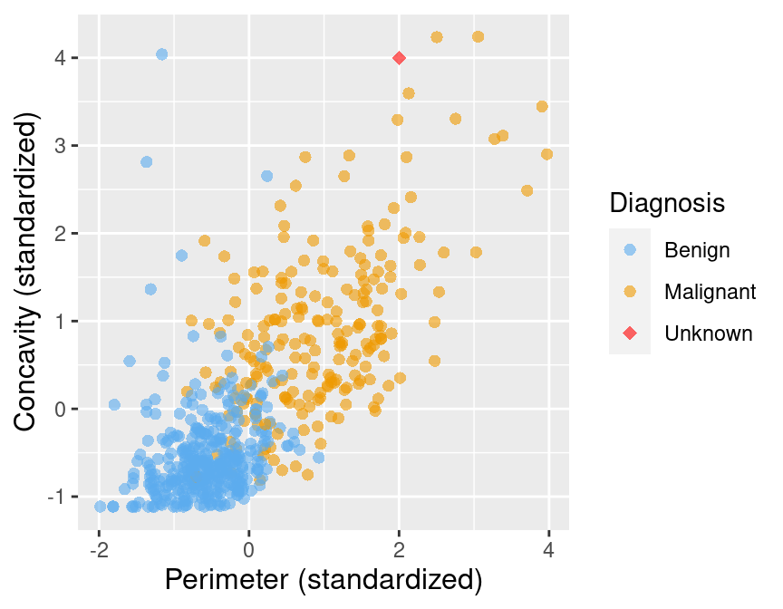
#Figura 5.2: Diagrama de dispersión de concavidad versus perímetro con la nueva observación representada como un rombo rojo.
```


La Figura 5.3 muestra que el punto más cercano a esta nueva observación es maligno y está ubicado en las coordenadas (2.1, 3.6). La idea aquí es que si un punto está cerca de otro en el diagrama de dispersión, entonces los valores del perímetro y la concavidad son similares, por lo que podemos esperar que tengan el mismo diagnóstico.
```{r Figure_5.3,echo=FALSE, fig.align='center', fig.cap='Figura 5.3: Diagrama de dispersión de concavidad versus perímetro. La nueva observación se representa como un diamante rojo con una línea al vecino más cercano, que tiene una etiqueta maligna',fig.width=10}

#Figura 5.3: Diagrama de dispersión de concavidad versus perímetro. La nueva observación se representa como un diamante rojo con una línea al vecino más cercano, que tiene una etiqueta maligna.
```

Supongamos que tenemos otra nueva observación con perímetro estandarizado de 0,2 y concavidad de 3,3. Observando el diagrama de dispersión de la figura 5.4, ¿cómo clasificaría esta observación de diamante rojo? El vecino más cercano a este nuevo punto es una observación benigna en (0.2, 2.7). ¿Parece que esta es la predicción correcta para esta observación? Probablemente no, si consideras los otros puntos cercanos.
```{r Figure_5.4,echo=FALSE, fig.align='center', fig.cap='Figura 5.4: Diagrama de dispersión de concavidad versus perímetro. La nueva observación se representa como un diamante rojo con una línea al vecino más cercano, que tiene una etiqueta benigna',fig.width=10}
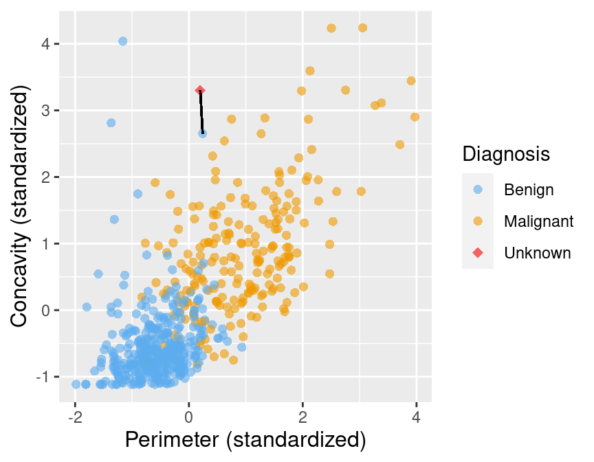
#Figura 5.4: Diagrama de dispersión de concavidad versus perímetro. La nueva observación se representa como un diamante rojo con una línea al vecino más cercano, que tiene una etiqueta benigna.
```

To improve the prediction we can consider several neighboring points, say  
K=3, that are closest to the new observation to predict its diagnosis class. Among those 3 closest points, we use the majority class as our prediction for the new observation. As shown in Figure 5.5, we see that the diagnoses of 2 of the 3 nearest neighbors to our new observation are malignant. Therefore we take majority vote and classify our new red, diamond observation as malignant.
```{r Figure_5.5,echo=FALSE, fig.align='center', fig.cap='Figure 5.5: Scatter plot of concavity versus perimeter with three nearest neighbors.',fig.width=10}
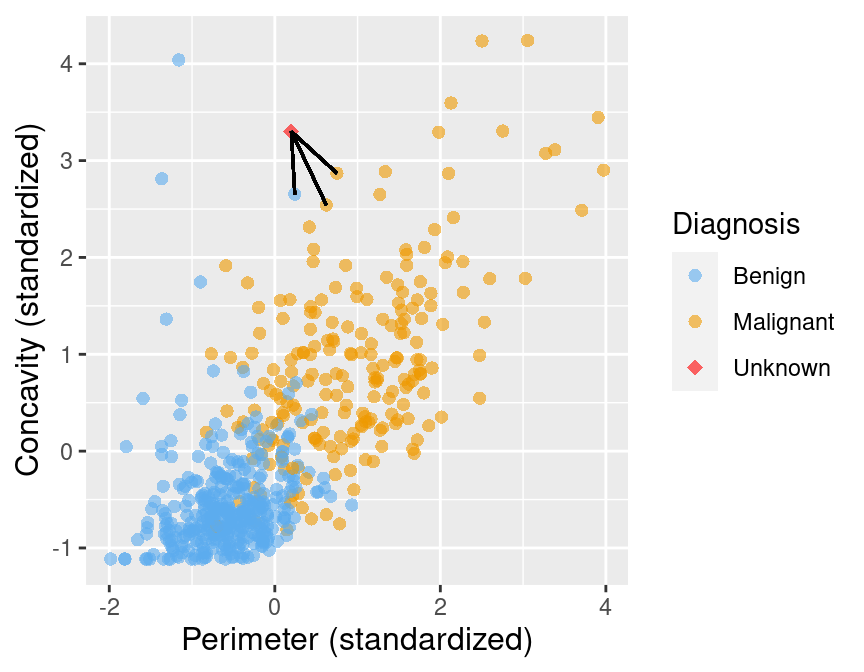
#Figure 5.5: Scatter plot of concavity versus perimeter with three nearest neighbors.
```

Aquí elegimos la k=3 observaciones más cercanas, pero no hay nada especial acerca de k=3. Podríamos haber usado k=4, 5 o más (aunque es posible que queramos elegir un número impar para evitar empates). Discutiremos más sobre la elección k en el próximo capítulo.

### 5.5.1 Distancia entre puntos
Decidimos qué puntos son los k "más cercano" a nuestra nueva observación utilizando la distancia en línea recta (a menudo nos referiremos a esto como distancia). Supongamos que tenemos dos observaciones a y b, cada uno con dos variables predictoras, X  y y. Denotar ax y ay para ser los valores de las variables X y y para observación a; bx y by tienen definiciones similares para la observación b. Entonces la distancia en línea recta entre la observación a y b en el plano x-y se puede calcular usando la siguiente fórmula:

```{r Formula1,echo=FALSE, fig.align='center', fig.cap='formula distance',fig.width=10}
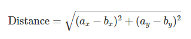
#Figure 5.5: Scatter plot of concavity versus perimeter with three nearest neighbors.
```

Para encontrar el vecinos más cercanos k a nuestra nueva observación, calculamos la distancia desde esa nueva observación a cada observación en nuestros datos de entrenamiento, y seleccionamos las observaciones k correspondientes a los valores k de distancia más pequeña. 
Por ejemplo, supongamos que queremos usar k=5 vecinos para clasificar una nueva observación con perímetro de 0 y concavidad de 3,5, que se muestra como un rombo rojo en la figura 5.6. Calculemos las distancias entre nuestro nuevo punto y cada una de las observaciones en el conjunto de entrenamiento para encontrar el k=5 vecinos que están más cerca de nuestro nuevo punto. Verá en el paso de mutación a continuación, calculamos la distancia en línea recta usando la fórmula anterior: elevamos al cuadrado las diferencias entre el perímetro de las dos observaciones y las coordenadas de concavidad, sumamos las diferencias al cuadrado y luego sacamos la raíz cuadrada.

```{r Figure_5.6,echo=FALSE, fig.align='center', fig.cap='Figure 5.6: Gráfico de dispersión de concavidad versus perímetro con nueva observación representada como un diamante rojo.',fig.width=10}
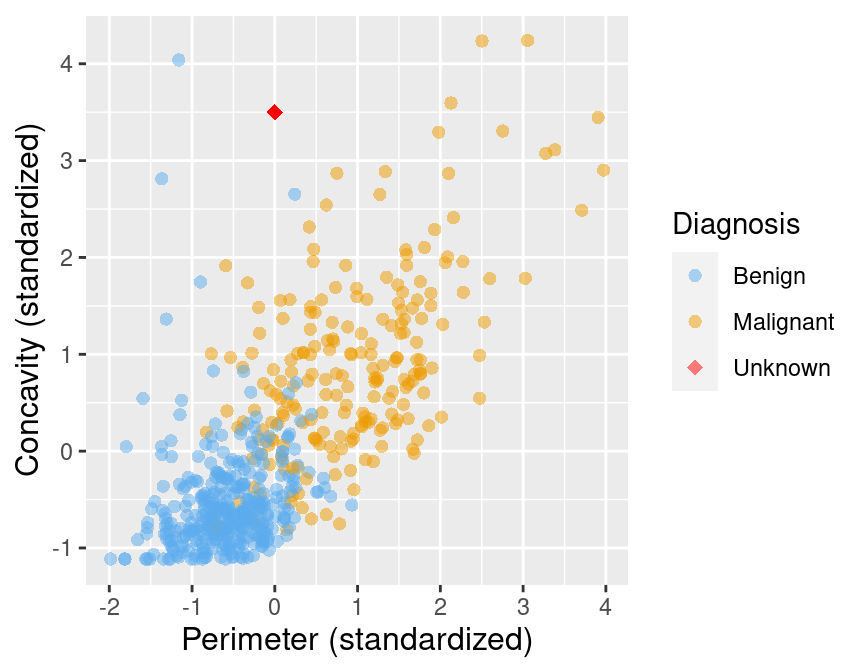
#Figure 5.6: Scatter plot of concavity versus perimeter with new observation represented as a red diamond.
```
```{r}
new_obs_perimeter <- 0
new_obs_concavity <- 3.5
kncx |>
  select(id, perimeter, concavity, class) |>
  mutate(dist_from_new = sqrt((perimeter - new_obs_perimeter)^2 + 
                              (concavity - new_obs_concavity)^2)) |>
  arrange(dist_from_new) |>
  slice(1:5) # take the first 5 rows
```

En la Tabla 5.1 mostramos en detalle matemático cómo se usó el paso de mutar para calcular la variable dist_from_new (la distancia a la nueva observación) para cada uno de los 5 vecinos más cercanos en los datos de entrenamiento.
```{r Table 5.1,echo=FALSE, fig.align='center', fig.cap='Figure 5.6: Evaluando las distancias desde la nueva observación a cada uno de sus 5 vecinos más cercanos.',fig.width=10}
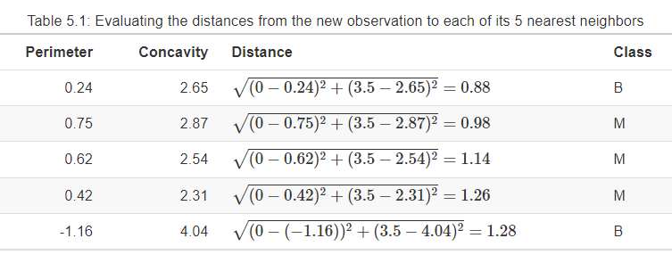
```
El resultado de este cálculo muestra que 3 de los 5 vecinos más cercanos a nuestra nueva observación son malignos (M); como esta es la mayoría, clasificamos nuestra nueva observación como maligna. Estos 5 vecinos están encerrados en un círculo en la Figura 5.7.

```{r Figure_5.7,echo=FALSE, fig.align='center', fig.cap='Figure 5.6: Figure 5.7: Scatter plot of concavity versus perimeter with 5 nearest neighbors circled',fig.width=10}
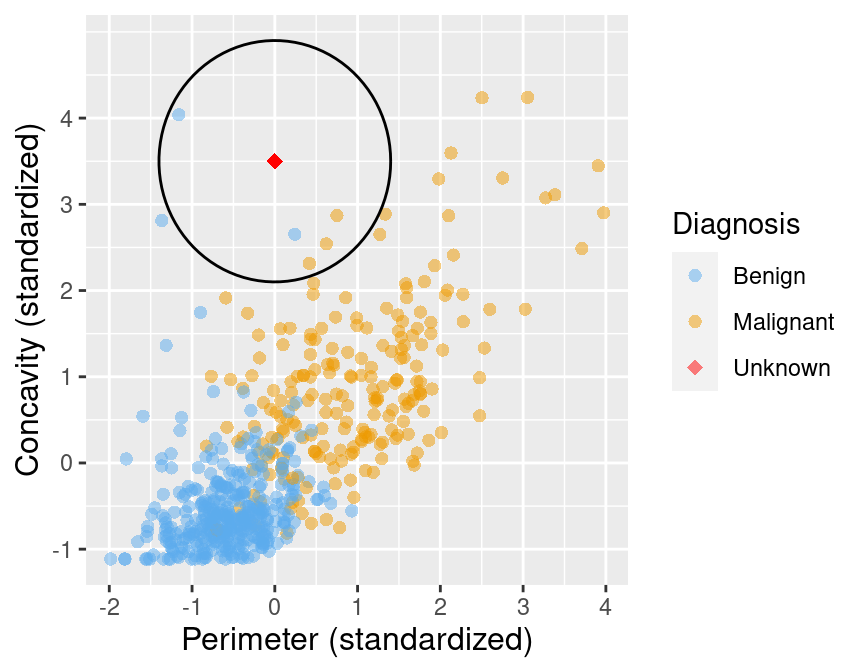
```
5.5.2 Más de dos variables explicativas
Aunque la descripción anterior está dirigida a dos variables predictoras, exactamente el mismo algoritmo k-nearest neighbors se aplica cuando tiene un mayor número de variables predictoras. Cada variable predictora puede darnos nueva información para ayudar a crear nuestro clasificador. La única diferencia es la fórmula para la distancia entre puntos. Supongamos que tenemos *m* variables predictoras para dos observaciones *a* y *b*, es decir, *a=(a1,a2,…,am)* y *b=(b1,b2,…,bm)*
La fórmula de la distancia se convierte en
```{r Formula1_secc_5.5.2,echo=FALSE, fig.align='center', fig.cap='',fig.width=10}
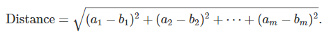
```
Esta fórmula todavía corresponde a una distancia en línea recta, solo que en un espacio con más dimensiones. Supongamos que queremos calcular la distancia entre una nueva observación con perímetro 0, concavidad 3,5 y simetría 1, y otra observación con perímetro, concavidad y simetría 0,417, 2,31 y 0,837 respectivamente. Tenemos dos observaciones con tres variables predictoras: perímetro, concavidad y simetría. Anteriormente, cuando teníamos dos variables, sumamos la diferencia al cuadrado entre cada una de nuestras (dos) variables y luego sacamos la raíz cuadrada. Ahora haremos lo mismo, excepto por nuestras tres variables. Calculamos la distancia de la siguiente manera
```{r Formula2_secc_5.5.2,echo=FALSE, fig.align='center', fig.cap='',fig.width=10}
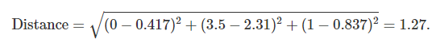
```

Calculemos las distancias entre nuestra nueva observación y cada una de las observaciones en el conjunto de entrenamiento para encontrar el k=5 vecinos cuando tenemos estos tres predictores.
```{r}
new_obs_perimeter <- 0
new_obs_concavity <- 3.5
new_obs_symmetry <- 1

kncx |>
  select(id, perimeter, concavity, symmetry, class) |>
  mutate(dist_from_new = sqrt((perimeter - new_obs_perimeter)^2 + 
                              (concavity - new_obs_concavity)^2 +
                                (symmetry - new_obs_symmetry)^2)) |>
  arrange(dist_from_new) |>
  slice(1:5) # take the first 5 rows
```

Basados en k=5 vecinos más cercanos con estos tres predictores clasificaríamos la nueva observación como maligna ya que 4 de cada 5 de los vecinos más cercanos son de clase maligna. La Figura 5.8 muestra cómo se ven los datos cuando los visualizamos como una dispersión tridimensional con líneas desde la nueva observación hasta sus cinco vecinos más cercanos.
```{r Figure_5.8,echo=FALSE, fig.align='center', fig.cap='Figura 5.8: Diagrama de dispersión 3D de las variables estandarizadas de simetría, concavidad y perímetro. Tenga en cuenta que, en general, recomendamos no utilizar visualizaciones 3D; aquí mostramos los datos en 3D solo para ilustrar cómo se ven las dimensiones más altas y los vecinos más cercanos, con fines de aprendizaje',fig.width=10}
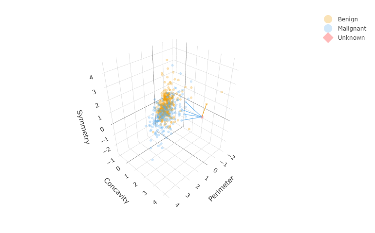
```
### 5.5.3 Resumen de K-nearest neighbors algorithm

Para clasificar una nueva observación usando un clasificador K-nearest neighbors, tenemos que hacer lo siguiente:

1. Calcule la distancia entre la nueva observación y cada observación en el conjunto de entrenamiento.
2. Ordene la tabla de datos en orden ascendente según las distancias.
3. Elija las k filas superiores de la tabla ordenada.
4. Clasifique la nueva observación con base en el voto mayoritario de las clases vecinas.


## 5.6 K-nearest neighbors con tidymodels

Codificando el algoritmo K-nearest neighbors en R puede complicarse, especialmente si queremos manejar múltiples clases, más de dos variables, o predecir la clase para múltiples observaciones nuevas. Afortunadamente, en R, el
algoritmo K-nearest neighbors se implementa en el paquete `parsnip` `R package` (Kuhn y Vaughan 2021) incluido en `tidymodels`, junto con muchos otros modelos que encontrará en este y futuros capítulos del libro. La colección `tidymodels` proporciona herramientas para ayudar a crear y usar modelos, como clasificadores. El uso de los paquetes de esta colección ayudará a mantener nuestro código simple, legible y preciso; cuanto menos tengamos que codificarnos, menos errores cometeremos. Empezamos cargando `tidymodels`.

Veamos cómo usar `tidymodels` para realizar una clasificacion K-nearest neighbors. Usaremos el conjunto de datos de cáncer de arriba, con el perímetro y la concavidad como predictores y k=5 vecinos para construir nuestro clasificador. Luego usaremos el clasificador para predecir la etiqueta de diagnóstico para una nueva observación con perímetro 0, concavidad 3.5 y una etiqueta de diagnóstico desconocida. Elijamos nuestras dos variables predictoras deseadas y la etiqueta de clase y almacenémoslas como un nuevo conjunto de datos llamado `kncx_train`:
```{r}
kncx_train <- kncx |>
  select(class, perimeter, concavity)

kncx_train
```

A continuación, creamos una especificación de modelo para K-nearest neighbors classification llamando a la función `nearest_neighbor`, especificando que queremos usar
k=5 (discutiremos cómo elegir k en el siguiente capítulo) y la distancia en línea recta (`weight_func ="rectangular"`). El argumento `weight_func` controla cómo votan los vecinos al clasificar una nueva observación; configurándolo en `"rectangular"`, cada uno de los k los vecinos más cercanos obtienen exactamente 1 voto como se describe arriba. Otras opciones, que pesan el voto de cada vecino de manera diferente, se pueden encontrar en el sitio web de `parsnip`. En el argumento `set_engine`, especificamos qué paquete o sistema se usará para entrenar el modelo. Aquí `kknn` es el paquete R que usaremos para realizar K-nearest neighbors classification. Finalmente, especificamos que este es un problema de clasificación con la función `set_mode`.

*PARSNIP*
```{r}
knn_spec <- parsnip::nearest_neighbor(weight_func = "rectangular", neighbors = 5) |>
  parsnip::set_engine("kknn") |>
  parsnip::set_mode("classification")

knn_spec
```

Para ajustar el modelo a los datos de cáncer de mama, necesitamos pasar la especificación del modelo y el conjunto de datos a la función `fit`. También necesitamos especificar qué variables usar como predictores y qué variable usar como objetivo. A continuación, el argumento `class ~ perimeter + concavity` especifica que `class` es la variable de destino (la que queremos predecir), y tanto el `perimeter` como la `concavity` se utilizarán como predictores.
```{r}
knn_fit <- knn_spec |>
  parsnip::fit(class ~ perimeter + concavity, data = kncx_train)
```

También podemos usar una sintaxis abreviada conveniente usando un punto,` Class ~ .`, para indicar que queremos usar todas las variables excepto `Class` como predictor en el modelo. En esta configuración particular, dado que `Concavity` y `Perimeter` son los dos únicos predictores en el marco de datos cancer_train, `Class ~ Perimeter + Concavity y Class ~ .` son equivalentes. En general, puede elegir predictores individuales con el símbolo `+` o puede especificar que se usen todos los predictores con el símbolo `.` [punto]
```{r}
knn_fit <- knn_spec |>
  parsnip::fit(class ~ ., data = kncx_train)
knn_fit
```

Aquí puede ver el resumen final del modelo entrenado. Confirma que el *computational engine* utilizado para entrenar el modelo fue `kknn::train.kknn`. También muestra la fracción de errores cometidos por el modelo vecino más cercano, pero lo ignoraremos por ahora y lo discutiremos con más detalle en el próximo capítulo. Finalmente, muestra (algo confusamente) que la "mejor" función de peso era "rectangular" y la "mejor" configuración de k era 5; pero dado que especificamos esto anteriormente, R solo nos está repitiendo esa configuración aquí. En el próximo capítulo, dejaremos que R encuentre el valor de k para nosotros.

Finalmente, hacemos la predicción sobre la nueva observación llamando a la función de predicción, pasando tanto el objeto de ajuste que acabamos de crear como la nueva observación en sí. Como arriba, cuando ejecutamos el K-nearest neighbors classification algorithm manualmente, el objeto `knn_fit` clasifica la nueva observación como maligna ("M"). Tenga en cuenta que la función `predict` genera un marco de datos con una sola variable llamada `.pred_class`.
```{r}
new_obs <- tibble(perimeter = 0, concavity = 3.5)

predict(knn_fit, new_obs)
```

¿Es esta etiqueta M predicha la verdadera clase para esta observación? Bueno, no lo sabemos porque no tenemos el diagnóstico de esta observación, ¡eso es lo que estábamos tratando de predecir! La predicción del clasificador no es necesariamente correcta, pero en el próximo capítulo aprenderemos formas de cuantificar qué tan precisas creemos que son nuestras predicciones.

# 5.7 Preprocesamiento de datos con tidymodels

### 5.7.1 Centrado y escalado

Cuando usas K-nearest neighbor classification, **la escala de cada variable (es decir, su tamaño y rango de valores) es importante. Dado que el clasificador predice clases al identificar las observaciones más cercanas a él, cualquier variable con una escala grande tendrá un efecto mucho mayor que las variables con una escala pequeña. Pero el hecho de que una variable tenga una gran escala no significa que sea más importante para hacer predicciones precisas**. Por ejemplo, suponga que tiene un conjunto de datos con dos características, salario (en dólares) y años de educación, y desea predecir el tipo de trabajo correspondiente. Cuando calculamos las distancias entre vecinos, una diferencia de $1000 es enorme en comparación con una diferencia de 10 años de educación. Pero para nuestra comprensión conceptual y respuesta al problema, es todo lo contrario; ¡10 años de educación es enorme en comparación con una diferencia de $1000 en salario anual!

En muchos otros modelos predictivos, el *centro* de cada variable (p. ej., su media) también es importante. Por ejemplo, si tuviéramos un conjunto de datos con una variable de temperatura medida en grados Kelvin, y el mismo conjunto de datos con una temperatura medida en grados Celsius, las dos variables diferirían en un cambio constante de 273 (aunque contienen exactamente la misma información ). Asimismo, en nuestro ejemplo hipotético de clasificación de puestos, probablemente veríamos que el centro de la variable salario está en las decenas de miles, mientras que el centro de la variable años de educación está en los dígitos individuales. Aunque esto no afecta la clasificacion k-nearest neighbor, este gran cambio puede cambiar el resultado del uso de muchos otros modelos predictivos.

Para escalar y centrar nuestros datos, necesitamos encontrar la media de nuestras variables (el promedio, que cuantifica el valor "central" de un conjunto de números) y la desviación estándar (un número que cuantifica cuán dispersos están los valores). Para cada valor observado de la variable, restamos la media (es decir, centramos la variable) y dividimos por la desviación estándar (es decir, escalamos la variable). Cuando hacemos esto, se dice que los datos están estandarizados, y todas las variables en un conjunto de datos tendrán una media de 0 y una desviación estándar de 1. Para ilustrar el efecto que la estandarización puede tener en el algoritmo k-nearest neighbor, leeremos en el conjunto de datos de cáncer de mama de Wisconsin original y no estandarizado; hemos estado utilizando una versión estandarizada [Nota de Esme: yo no he utilizado antes la version estandarizada, solo tengo la version sin estandarizar] de la configuración de datos hasta ahora. Para simplificar las cosas, solo usaremos las variables `area`, `smoothness` y `class`:
```{r}
unscaled_cancer <- read_csv("Input/data2.csv") |> #unscaled data
  mutate(class = as_factor(class)) |>
  select(class, area, smoothness)

unscaled_cancer
```

Al observar los datos anteriores sin escalar y sin centrar, puede ver que las diferencias entre los valores para las mediciones del área son mucho mayores que las de la suavidad. ¿Afectará esto a las predicciones? Para averiguarlo, crearemos un diagrama de dispersión de estos dos predictores (coloreados por diagnóstico) tanto para los datos no estandarizados que acabamos de cargar como para la versión estandarizada de esos mismos datos. Pero primero, necesitamos estandarizar el conjunto de datos de *unscaled_cancer* con tidymodels.

En el marco de tidymodels, todo el preprocesamiento de datos ocurre usando`recipe` del paquete `recipes` de `R` (Kuhn y Wickham 2021) Aquí inicializaremos una `receta` para los datos de `unscaled_cancer` anteriores, especificando que la variable `class` es el objetivo, y todas las demás variables son predictores:

*RECIPE*
```{r}
uc_recipe <- recipes::recipe(class ~ ., data = unscaled_cancer)

print(uc_recipe)
```

Hasta ahora, no hay mucho en la receta; solo una declaración sobre el número de objetivos y predictores. Agreguemos pasos de escalado (`step_scale`) y centrado (`step_center`) para todos los predictores, de modo que cada uno tenga una media de 0 y una desviación estándar de 1. Tenga en cuenta que tidyverse en realidad proporciona step_normalize, que centra y escala en un solo paso de receta ; en este libro mantendremos `step_scale` y `step_center` separados para enfatizar conceptualmente que están ocurriendo dos pasos. La función `prep` finaliza la receta usando los datos (aquí, `unscaled_cancer`) para calcular todo lo necesario para ejecutar la receta (en este caso, las medias de la columna y las desviaciones estándar):

```{r}
uc_recipe <- uc_recipe |>
  recipes::step_scale(recipes::all_predictors()) |>
  recipes::step_center(recipes::all_predictors()) |>
  recipes::prep()

uc_recipe
```


Ahora puede ver que la receta incluye un paso de escalado y centrado para todas las variables predictoras. Tenga en cuenta que cuando agrega un paso a una receta, debe especificar a qué columnas aplicar el paso. Aquí usamos la función all_predictors() para especificar que cada paso debe aplicarse a todas las variables predictoras. Sin embargo, hay varios argumentos diferentes que uno podría usar aquí, además de nombrar columnas particulares con la misma sintaxis que la función de selección. Por ejemplo:

- `all_nominal()` y `all_numeric()`: para especificat todas las variables categoricas o numericas
- `all_predictors()` y `all_outcomes()`: para especificar todos los predictores o todas las variables target
- `Area`, `Smoothness`: especificar ambas variables, area and smoothenes
- `-Class`: especificat todo exscepto la variable target

Puede encontrar un conjunto completo de todos los pasos y funciones de selección de variables en la página de referencia de recetas.

En este punto, hemos calculado las estadísticas requeridas en función de la entrada de datos en la receta, pero los datos aún no están escalados ni centrados. Para escalar y centrar realmente los datos, necesitamos aplicar la función `bake` a los datos sin escalar.
```{r}
scaled_cancer <- recipes::bake(uc_recipe, unscaled_cancer)

scaled_cancer
```

Puede parecer redundante que tuviéramos que hornear (`bake`) y preparar (`prep`) para escalar y centrar los datos. Sin embargo, hacemos esto en dos pasos para que podamos especificar un conjunto de datos diferente en el paso `bake` si lo deseamos. Por ejemplo, es posible que queramos especificar nuevos datos que no formaban parte del conjunto de entrenamiento.

Quizás se pregunte por qué estamos trabajando tanto para centrar y escalar nuestras variables. ¿No podemos simplemente escalar y centrar manualmente las variables area y amoothness antes de construir nuestro modelo k-nearest neghbor? Bueno, técnicamente sí; pero hacerlo es propenso a errores. En particular, podemos olvidarnos accidentalmente de aplicar el mismo centrado/escala al hacer predicciones, o accidentalmente aplicar un centrado/escala diferente al que usamos durante el entrenamiento. El uso adecuado de una receta ayuda a mantener nuestro código simple, legible y libre de errores. Además, tenga en cuenta que el uso de `prep` y `bake` solo es necesario cuando desea inspeccionar el resultado de los pasos de preprocesamiento usted mismo. Verá más adelante en la Sección 5.8 que `tidymodels` proporciona herramientas para aplicar automáticamente la preparación y hornear según sea necesario sin un esfuerzo de codificación adicional.

La Figura 5.9 muestra los dos diagramas de dispersión uno al lado del otro: uno para `unscaled_cancer` y otro para `scaled_cancer`. Cada uno tiene la misma nueva observación anotada con su k=3 vecinos más cercanos. En el gráfico de datos no estandarizados original, puede ver algunas opciones extrañas para los tres vecinos más cercanos. En particular, los "vecinos" están visualmente bien dentro de la nube de observaciones benignas, y todos los vecinos están alineados casi verticalmente con la nueva observación (por lo que parece que solo hay una línea negra en este gráfico). La figura 5.10 muestra un primer plano de esa región en el gráfico no estandarizado. Aquí, el cálculo de los vecinos más cercanos está dominado por la variable de área de escala mucho mayor. La gráfica de datos estandarizados a la derecha en la Figura 5.9 muestra una selección de vecinos más cercanos mucho más intuitivamente razonable. Por lo tanto, estandarizar los datos puede cambiar las cosas de manera importante cuando usamos algoritmos predictivos. La estandarización de sus datos debe ser parte del preprocesamiento que realiza antes del modelado predictivo y siempre debe pensar detenidamente en el dominio de su problema y si necesita estandarizar sus datos.

```{r Figure_5.9,echo=FALSE, fig.align='center', fig.cap='Figura 5.9: Comparación de K = 3 vecinos más cercanos con datos estandarizados y no estandarizados.',fig.width=10}
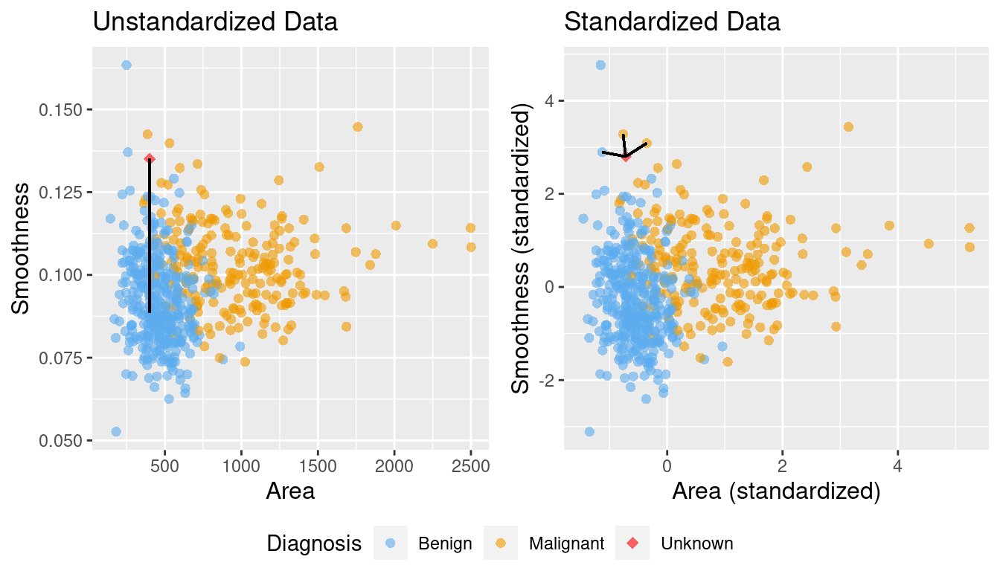
```

```{r Figure_5.10,echo=FALSE, fig.align='center', fig.cap='Figure 5.10: Close-up of three nearest neighbors for unstandardized data',fig.width=10}
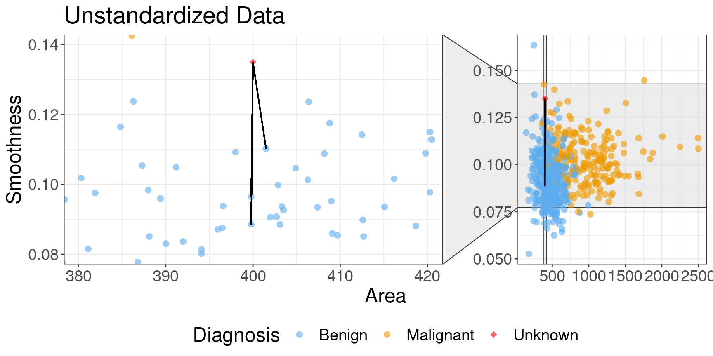
```

### 5.7.2 Equilibrado
Otro problema potencial en un conjunto de datos para un clasificador es el desequilibrio de clases, es decir, cuando una etiqueta es mucho más común que otra. Dado que los clasificadores como el k-nearest neighbor usa las etiquetas de los puntos cercanos para predecir la etiqueta de un nuevo punto, si hay muchos más puntos de datos con una etiqueta en general, es más probable que el algoritmo elija esa etiqueta en general (incluso si el "patrón" de los datos sugieren lo contrario). El desequilibrio de clases es en realidad un problema bastante común e importante: desde el diagnóstico de enfermedades raras hasta la detección de correo electrónico malicioso, hay muchos casos en los que la clase "importante" a identificar (presencia de enfermedad, correo electrónico malicioso) es mucho más rara que la clase "sin importancia". (sin enfermedad, correo normal).

Para ilustrar mejor el problema, revisemos los datos de cáncer de mama escalados, `cancer`; excepto que ahora eliminaremos muchas de las observaciones de tumores malignos, simulando cómo se verían los datos si el cáncer fuera raro. Haremos esto seleccionando solo 3 observaciones del grupo maligno y conservando todas las observaciones benignas. Elegimos estas 3 observaciones usando la función `slice_head`, que toma dos argumentos: un objeto similar a un marco de datos y el número de filas para seleccionar desde la parte superior (n). Los nuevos datos desequilibrados se muestran en la Figura 5.11.

```{r}
rare_cancer <- bind_rows(
      filter(kncx, class == "B"),
      kncx |> filter(class == "M") |> slice_head(n = 3)
    ) |>
    select(class, perimeter, concavity)

rare_plot <- rare_cancer |>
  ggplot(aes(x = perimeter, y = concavity, color = class)) +
  geom_point(alpha = 0.5) +
  labs(x = "Perimeter (standardized)", 
       y = "Concavity (standardized)",
       color = "Diagnosis",
       subtitle = "Figura 5.11: Datos imbalanceados") +
  scale_color_manual(labels = c("Malignant", "Benign"), 
                     values = c("orange2", "steelblue2")) +
  theme(text = element_text(size = 12))

rare_plot
```

Supongamos que ahora decidimos usar k=7 en k-nearest neighbor. ¡Con solo 3 observaciones de tumores malignos, el clasificador siempre predecirá que el tumor es benigno, sin importar cuál sea su concavidad y perímetro! Esto se debe a que en un voto mayoritario de 7 observaciones, como máximo 3 serán malignas (solo tenemos 3 observaciones malignas en total), por lo que al menos 4 deben ser benignas, y el voto benigno siempre ganará. Por ejemplo, la figura 5.12 muestra lo que sucede con una nueva observación de tumor que está bastante cerca de tres observaciones en los datos de entrenamiento que se etiquetaron como malignos.
```{r Figure_5.12,echo=FALSE, fig.align='center', fig.cap='Figure 5.12: Imbalanced data with 7 nearest neighbors to a new observation highlighted.',fig.width=10}
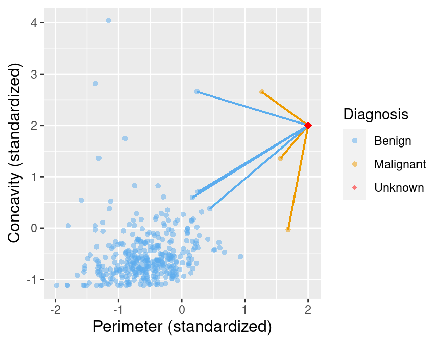
```

La Figura 5.13 muestra lo que sucede si establecemos el color de fondo de cada área de la gráfica para las predicciones del
k-nearest neighbor. Podemos ver que la decisión es siempre "benigna", correspondiente al color azul.
```{r Figure_5.13,echo=FALSE, fig.align='center', fig.cap='Figure 5.13: Imbalanced data with background color indicating the decision of the classifier and the points represent the labeled data.',fig.width=10}
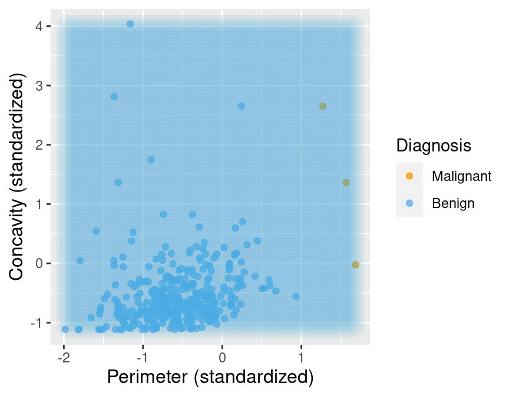

```

A pesar de la simplicidad del problema, resolverlo de una manera estadísticamente sólida en realidad tiene bastantes matices, y un tratamiento cuidadoso requeriría muchos más detalles y matemáticas de las que cubriremos en este libro de texto. Para los fines presentes, bastará con reequilibrar los datos *oversampling* la clase rara. En otras palabras, replicaremos observaciones raras varias veces en nuestro conjunto de datos para darles más poder de voto en el
k-nearest neighbor. Para hacer esto, agregaremos un paso de sobremuestreo a la receta anterior `uc_recipe` con la función `step_upsample` del paquete `themis` `R`. Mostramos a continuación cómo hacer esto, y también usamos las funciones `group_by` y `summarize` para ver que nuestras clases ahora están equilibradas:
```{r}
library(themis)

ups_recipe <- recipe(class ~ ., data = rare_cancer) |>
  step_upsample(class, over_ratio = 1, skip = FALSE) |>
  prep()

ups_recipe
```


```{r}
upsampled_cancer <- bake(ups_recipe, rare_cancer)

upsampled_cancer |>
  group_by(class) |>
  summarize(n = n())
```

Ahora supongamos que entrenamos a nuestro k-nearest neighbor con k=7 en estos datos equilibrados. La Figura 5.14 muestra lo que sucede ahora cuando establecemos el color de fondo de cada área de nuestro diagrama de dispersión a la decisión de la
k-nearest neighbor. Podemos ver que la decisión es más razonable; cuando los puntos están cerca de los etiquetados como malignos, el clasificador predice un tumor maligno, y viceversa cuando están más cerca de las observaciones de tumores benignos.
```{r Figure_5.14,echo=FALSE, fig.align='center', fig.cap='Figure 5.14: Figure 5.14: Upsampled data with background color indicating the decision of the classifier.',fig.width=10}
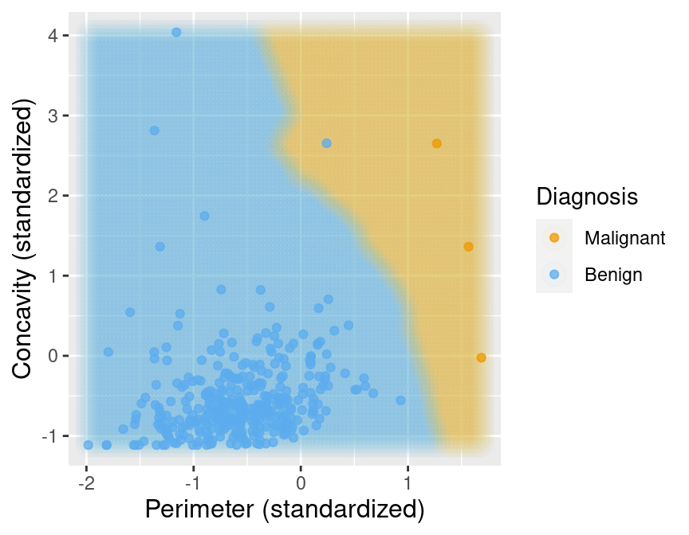

```

5.8 Poniéndolo junto en un `workflow`
La colección de paquetes de `tidymodels` también proporciona `workflow`, una forma de encadenar varios pasos de análisis de datos sin mucho código necesario para los pasos intermedios. Para ilustrar toda la canalización, comencemos desde cero con los datos `unscaled_wdbc.csv`. Primero cargaremos los datos, crearemos un modelo y especificaremos una receta sobre cómo se deben preprocesar los datos:
```{r}
# load the unscaled cancer data 
# and make sure the target Class variable is a factor
unscaled_cancer <- read_csv("Input/data2.csv") |>
  mutate(class = as_factor(class))

# create the KNN model
knn_spec <- parsnip::nearest_neighbor(weight_func = "rectangular", neighbors = 7) |>
  parsnip::set_engine("kknn") |>
  parsnip::set_mode("classification")

# create the centering / scaling recipe
uc_recipe <- recipe(class ~ area + smoothness, data = unscaled_cancer) |>
  step_scale(all_predictors()) |>
  step_center(all_predictors())
```

Tenga en cuenta que cada uno de estos pasos es exactamente igual que antes, excepto por una gran diferencia: no usamos la función `select` para extraer las variables relevantes del marco de datos, y en su lugar simplemente especificamos las variables relevantes para usar a través de la fórmula` class ~ area + smoothness` (en lugar de `class ~ .`) en la receta. También notará que no llamamos a prep() en la receta; esto no es necesario cuando se coloca en un flujo de trabajo.

Ahora colocaremos estos pasos en un `workflow` usando las funciones `add_recipe` y `add_model`, y finalmente usaremos la función `fit` para ejecutar todo el workflow en los datos de `unscaled_cancer`. Tenga en cuenta otra diferencia con respecto a lo anterior aquí: no incluimos una fórmula en la función `fit`. Esto se debe nuevamente a que incluimos la fórmula en la `receta`, por lo que no es necesario volver a especificarla:

```{r}
knn_fit <- workflows::workflow() |>
  workflows::add_recipe(uc_recipe) |>
  workflows::add_model(knn_spec) |>
  parsnip::fit(data = unscaled_cancer)

knn_fit
```

Como antes, el objeto de ajuste enumera la función que entrena el modelo, así como las "mejores" configuraciones para el número de vecinos y la función weight (por ahora, estos son solo los valores que elegimos manualmente cuando creamos `knn_spec` arriba). Pero ahora el objeto de ajuste también incluye información sobre el flujo de trabajo general, incluidos los pasos de preprocesamiento de centrado y escalado. En otras palabras, cuando usamos la función `predict` con el objeto `knn_fit` para hacer una predicción para una nueva observación, primero aplicará los mismos pasos de receta a la nueva observación. Como ejemplo, predeciremos la etiqueta de clase de dos nuevas observaciones: una con `Área = 500` y `Suavidad = 0,075`, y otra con `Área = 1500` y `Suavidad = 0,1`.
```{r}
new_observation <- tibble(area = c(500, 1500), smoothness = c(0.075, 0.1))
prediction <- predict(knn_fit, new_observation)

prediction
```

El clasificador predice que la primera observación es benigna (“B”), mientras que la segunda es maligna (“M”). La Figura 5.15 visualiza las predicciones que este modelo k-nearest neghbor entrenado se basará en una amplia gama de nuevas observaciones. Aunque ya ha visto visualizaciones de mapas de predicción en color como esta varias veces, no hemos incluido el código para generarlas, ya que es un poco complicado. Para el lector interesado que quiere un desafío de aprendizaje, ahora lo incluimos a continuación. La idea básica es crear una cuadrícula de nuevas observaciones sintéticas utilizando la función `expand.grid`, predecir la etiqueta de cada una y visualizar las predicciones con una dispersión de color que tenga una transparencia muy alta (valor `alpha` bajo) y un radio de punto grande. ¡Vea si puede averiguar qué está haciendo cada línea!

*Note: Understanding this code is not required for the remainder of the textbook. It is included for those readers who would like to use similar visualizations in their own data analyses*
```{r}
# create the grid of area/smoothness vals, and arrange in a data frame
are_grid <- seq(min(unscaled_cancer$area), 
                max(unscaled_cancer$area), 
                length.out = 100)
smo_grid <- seq(min(unscaled_cancer$smoothness), 
                max(unscaled_cancer$smoothness), 
                length.out = 100)
asgrid <- as_tibble(expand.grid(area = are_grid, 
                                smoothness = smo_grid))

# use the fit workflow to make predictions at the grid points
knnPredGrid <- predict(knn_fit, asgrid)

# bind the predictions as a new column with the grid points
prediction_table <- bind_cols(knnPredGrid, asgrid) |> 
  rename(class = .pred_class)

# plot:
# 1. the colored scatter of the original data
# 2. the faded colored scatter for the grid points
wkflw_plot <-
  ggplot() +
  geom_point(data = unscaled_cancer, 
             mapping = aes(x = area, 
                           y = smoothness, 
                           color = class), 
             alpha = 0.75) +
  geom_point(data = prediction_table, 
             mapping = aes(x = area, 
                           y = smoothness, 
                           color = class), 
             alpha = 0.02, 
             size = 5) +
  labs(color = "Diagnosis", 
       x = "Area (standardized)", 
       y = "Smoothness (standardized)",
       caption = "Figure 5.15: Scatter plot of smoothness versus area\nwhere background color indicates the decision of the classifier.") +
  scale_color_manual(labels = c("Malignant", "Benign"), 
                     values = c("orange2", "steelblue2")) +
  theme(text = element_text(size = 12))

wkflw_plot
```

## Referencias

Cover, Thomas, and Peter Hart. 1967. “Nearest Neighbor Pattern Classification.” IEEE Transactions on Information Theory 13 (1): 21–27.
Fix, Evelyn, and Joseph Hodges. 1951. “Discriminatory Analysis. Nonparametric Discrimination: Consistency Properties.” USAF School of Aviation Medicine, Randolph Field, Texas.
Kuhn, Max, and David Vaughan. 2021. parsnip R package. https://parsnip.tidymodels.org/.
Kuhn, Max, and Hadley Wickham. 2021. recipes R package. https://recipes.tidymodels.org/.
Stanford Health Care. 2021. “What Is Cancer?” https://stanfordhealthcare.org/medical-conditions/cancer/cancer.html.
Street, William Nick, William Wolberg, and Olvi Mangasarian. 1993. “Nuclear Feature Extraction for Breast Tumor Diagnosis.” In International Symposium on Electronic Imaging: Science and Technology.

